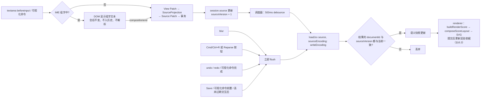
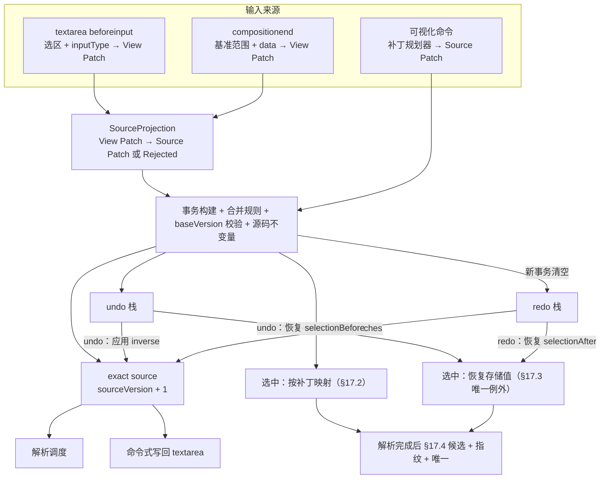
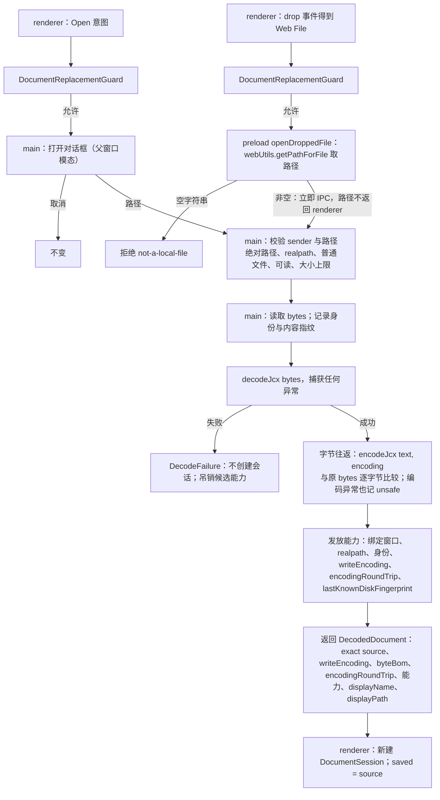
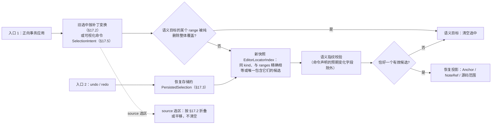
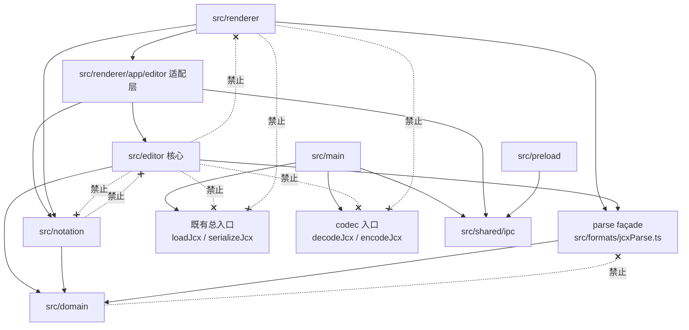

# M3 Editor Core —— 架构冻结方案（M3.P0，第五版）

> 状态：**v5 ✅ FROZEN（M3.P0 SEALED，2026-10-07，用户批准冻结）**。冻结依据：CRITICAL = 0、HIGH = 0、P0 阻断类 MEDIUM = 0、H-1 已关闭。本文件只做架构设计与任务拆分，**不含任何实现**；M3 implementation NOT STARTED，下一步为 T0。
> 冻结后不再启动新的 M3.P0 架构审查、不再扩写本文件；post-M3 / LOW / robustness debt 保留在 §26；实现阶段发现的问题按 T0–T9 各阶段 gate 处理，不重新打开 P0。
> 带入 T5 的非阻塞契约事项：`SaveResult { requestId, phase, ok, clean }`，`phase` 标识具体阶段实例（intent 内递增 sequence / generation），用于拒绝旧 saving phase 的迟到 `SaveResult`。
> 基线：HEAD = origin/main = `30395fe`（M2.5 Score System Layout ✅ SEALED，Stage B CI run 37457437828 三平台 success）。
> 用户裁决见第 27 节；§27.3 的条目按推荐默认进入实施，在对应阶段 preflight 中由用户最终确认。
>
> 证据来源：只读核对源码与测试，并在 scratchpad 中运行只读探针（不写仓库）。真实语料只以 corpus#NN 指代。
> 文中 `file:line` 均指 `30395fe` 时的源码。

---

## 0. 修订记录

### 0.1 v4 → v5（局部收尾：关闭第四轮 MEDIUM M-A～M-G）

| # | 第四轮发现 | v5 处理 | 位置 | 状态 |
|---|---|---|---|---|
| M-A | parse-only 入口位于 `formats/jcx/` 下，会被冻结守卫 `architecture.test.ts:290`（`/formats\/jcx\/./`）拦下 | renderer-safe parse façade 移到 `src/formats/jcx/` 目录**之外**（`src/formats/jcxParse.ts`）；façade 不经 `index.ts`、只从 `./jcx/loadJcx` 与类型定义模块取得导出；冻结守卫不修改、不放宽；新增 A10 | §11.1、§21、§3.2 A10 | 关闭 |
| M-B | unload「一次性 bypass」可残留，并会丢掉保存期间的输入 | 删除任何可残留的放行标志；Save 应答为 `{ ok, clean }`，只有 `ok && clean` 才重试**当前**待执行的 unload intent；`ok && !clean` 不 unload、重新进入守卫；批准状态只绑定在单个 pending intent 上，不跨 intent 存活 | §15.2、§15.3、§20 | 关闭 |
| M-C | GB18030 文件开头的 U+FEFF 使 `hasBom` 不变量失效 | 拆成两个事实：字节级 `byteBom`（只来自原始字节检测）与文本级 `protectedLeadingFeff`（Exact Source 是否以 U+FEFF 开头）；SourceProjection 只用 `protectedPrefixLength`；补 Electron 测试向量 | §6.3、§7.1、§11.2、§25.2 | 关闭 |
| M-D | 冻结哈希清单覆盖不全 | 重审候选清单：补 serializer / domain / M2 / M2.5 全部架构守卫、M2.5 system / layout 合同与不应被 M3 修改的 renderer 集成文件；M3 必改文件明确排除 | §21.3 | 关闭 |
| M-E | Historical Amendments 遗漏与不准确 | 新增 A5（TECHNICAL_PLAN §8 写回机制）、A10（formats 入口组织）、A11（F6 模式切换控件延期）；改正 A8；§10.1 欢迎页与 F3 最近文件列为既有实现债 / 延期；放宽「renderer 拿不到任何路径」为「只读展示用 `displayPath` 不构成授权」 | §3.2、§13 | 关闭 |
| M-F | 规划器给出的 selectionAfter 构成第三个选中入口 | 规划器只能给出 `SelectionIntent`（候选范围 + 预期指纹），仍须经候选 → 指纹 → 唯一校验；事务的 `selectionAfter` 只记录 §17 的结果；选中进入新版本仍只有两个入口 | §9.2、§10、§17 | 关闭 |
| M-G | 根卸载后关窗 / unload 守卫无人应答 | 守卫应答方（replacement / unload-save responder）放在模块级适配层，不依赖 React 树；React 已卸载时由 main 原生对话框询问；崩溃仍属 post-M3 | §15.7、§19.2 | 关闭 |

- 编号说明：v4 中的 A5（formats 单一入口）在 v5 移为 **A10**；v5 的 A5 是 TECHNICAL_PLAN §8。

**v5 定点复核后的补充修订**

| # | 复核发现 | 处理 | 状态 |
|---|---|---|---|
| F1 | MEDIUM（correctness）：pending intent 只有 `discardApproved`，clean 时的关窗 / 退出重入、批准后又变 dirty、quit 中止后残留批准都未定义 | `approval: 'pending' \| 'proceed' \| 'discard'`；决定值补 `proceed`；close / before-quit 批准后重入放行；只有 `discard` 可在 `will-prevent-unload` 放行，`proceed` 后又变 dirty → 销毁并重新同步询问；quit 中止销毁全部窗口 intent（§15.2、§15.3、§13.4）；其中退出部分后由 M1 / M2 的单 intent 模型取代 | 关闭 |
| F2 | MEDIUM（wording）：§21.3「被锁测试对 M3 必改文件无代码级依赖」不实 | 改为列出 t9b / t9c / t9cp / `tab.toSvg` 对 ScoreView 与 global.css 的文本级断言；§29 补列 CSS 与 renderer 全体约束 | 关闭 |
| F3 | LOW：§16.3 误称 StaffSystemView 用 passive effect | StaffSystemView 用 `useLayoutEffect`；渲染依据改为与快照同次提交写入的 React 属性（采纳第四轮 L-2 原建议） | 已修正 |
| F4 | LOW：闭包守卫未断言「无外部包」 | 补「闭包中不出现裸说明符」（§21.2） | 已修正 |
| F5 | LOW：renderer 可从 façade 拿到 editor 专用 AST 工具 | renderer 从 façade 导入的名称白名单（§21.2） | 已修正 |
| F6 | LOW：A5 引用位置；A11 附注 | A5 改引 TECHNICAL_PLAN §2；A11 附注工具栏「保存（编辑模式下）」 | 已修正 |
| F7 | LOW：§10 selectionBefore 措辞 | 改正 | 已修正 |
| F8 | LOW：清单漏两份 domain 测试 | 锁 `tests/unit/domain/**` | 已修正 |
| F9 | LOW：React 卸载后 renderer 发起的替换 | 一律拒绝并提示先保存再重载（§15.7） | 已修正 |
| N1 | MEDIUM（correctness，F1 修订后的窄复核）：quit 开始时窗口已有 intent 未定义 | 先以 quitId 收养方案修订，第三次窄复核发现仍有缺口（见 M1 / M2），最终由单 intent 简化模型取代 | 关闭（经 M1 / M2） |
| N2 | MEDIUM（architecture）：§13.4 守卫通道与 §15.3 / §15.7 正文不一致 | `unload-save-request` 先 ack 再应答 `SaveResult { requestId, ok, clean }`；`replacement-decision` 增加 ack 与 `uiUnavailable`；统一 `requestId`；原生对话框「保存」复用 `unload-save-request`（§13.4、§15.3、§15.7） | 关闭 |
| N3 | LOW：quit 中 proceed 又变 dirty 的「中止退出」与 Electron quit 流程不符 | 新 intent 继承 `thenQuit`：不保存 → 关闭后退出；取消 → 退出中止；保存成功 → `close()` 后退出（§15.3） | 已修正 |
| N4 | LOW：多窗口时 discard 批准未绑定版本 | 写明单窗口假设；多窗口为 debt（§15.2、§26 R25） | debt |
| N5 | LOW：超时口径不明 | 只按存活确认 ack 计时（§15.2） | 已修正 |
| N6 | LOW：缺变异项；saveInFlight 清除时机 | 补变异；规定先清 saveInFlight 再应答（§15.2、§25.3） | 已修正 |
| N7 | LOW：§16.3 行号、「不新增 hook」措辞、同一快照对象前提 | 改为 `:30`、「不新增 effect」，补前提并由测试锁定（§16.3） | 已修正 |
| M1 / M2 | MEDIUM（correctness，第三次窄复核）：Quit 收养 reload intent 后执行 reload 吞掉退出；等待的 intent 无失败出口，quit 状态可能停在 asking 或残留 approved | **改为简化模型**而非继续补丁：单窗口下同一时刻至多一个 guard intent；没有独立 quitIntent，Quit 只给 close intent 置 `thenQuit`（遇 reload intent 拒绝并提示）；intent 以 `closed` 以外方式结束即退出中止，不留任何退出批准（§15.2、§15.3） | 关闭 |
| L1 | LOW：`unload-save-request` 无 ack；ack 后 renderer 卡死无出口 | 两个请求都先 ack；ack 超时或 `unresponsive` 事件时提供强制关闭（§15.2、§13.4） | 已修正 |
| L2 | LOW：缺 React 卸载后数据丢失变异 | §25.3 补齐 | 已修正 |
| L3 | LOW：N1 状态措辞 | N1 / N3 的 quitId 方案已被 M1 / M2 的简化模型取代 | 已修正 |
| G-1 | MEDIUM（correctness，单 intent 模型确认）：§15.3 discard 分支「清除」intent，丢掉 `thenQuit`（dirty + Cmd+Q + 不保存时 macOS 不退出） | discard 只放行、不销毁，统一按 §15.2 销毁条件结束 | 关闭 |
| G-2 | MEDIUM（correctness）：询问进行中 React 根卸载，已 ack 的询问永久悬空 | 致命处理立即以同一 requestId 结束询问（clean → `proceed`，dirty → `uiUnavailable`）；轻提示改由 main / 非 React DOM 给出（§15.7） | 关闭 |
| G-3 | MEDIUM（correctness）：「强制关闭」等价 discard 仍依赖 renderer 配合 | 强制关闭 = `win.destroy()`，不受执行时限约束；reload 类的强制选项也是关窗；T5 实测（§15.2） | 关闭 |
| G-L1 | LOW：执行超时后 `close()` 迟到完成 | §26 R26 | debt |
| G-L2 | LOW：unload-save 的 `ok && !clean` 由谁再问；§15.4 等待超时 | 同一 requestId 经 `replacement-request` 再问；等待超时按 cancel（§15.3、§15.4） | 已修正 |
| G-L3 | LOW：「reload 已提交」检测事件未指定 | 主 frame `did-start-navigation`（非同文档）或 `render-process-gone`（§15.2） | 已修正 |
| H-1 | MEDIUM（correctness，G 修订确认）：reload 类 intent 收到异步决定后无执行规则（可能永久残留 discard、关闭退出无出口） | §15.2 新增通用执行规则：任意 kind 收到 `proceed` / `discard` 按 kind 执行 `close()` / `reload()`，`cancel` 销毁 | 关闭 |
| H-L1 | LOW：「继续等待」后不再计时、不再提供强制选项 | 重新计时；未 ack / unresponsive 时再次 close / quit 重新弹出对话框（§15.2） | 已修正 |
| H-L2 | LOW：同一 requestId 多个应答 | 初稿「每个 requestId 只接受第一个终态应答」会误伤中间应答（H-1 窄复核指出），已改为状态机语义：同一 replacement intent 允许多个中间阶段；每个 phase 最多消费一个有效应答，进入下一 phase 后忽略上一阶段迟到 / 重复应答；intent 只允许一次终态迁移到 proceed / discard / cancel；保存 `!ok` 归入 cancel（§15.2） | 已修正 |
- 第四轮 LOW L-1～L-12 的处理见 §0.3。

### 0.2 v3 → v4（关闭第三轮 4 条 HIGH 与相关 MEDIUM；本表保留 v4 原貌，其中 U+FEFF、unload、formats 入口三行已被 v5 的 M-C、M-B、M-A 修正，见 §0.1）

| 主题 | v4 | 位置 |
|---|---|---|
| 过期 DOM 交互（HIGH-1） | 谱面根节点携带渲染依据（documentId + sourceVersion）；只有「渲染版本 = 解析版本 = 当前版本」时才解释 anchor，否则丢弃该次交互 → 按需解析 → 重渲染 → 提示重新点击；过期诊断同样处理；不做「旧 anchor → 补丁日志 → 当前对象」迁移 | §16.3 |
| 同一文件判定（HIGH-2） | `sameFile = sameCanonicalPath OR sameMeaningfulStatIdentity`；POSIX 用 dev + ino 辅助，Windows 只用路径；每次写盘前由 main 实时重查，每次原子替换成功后刷新 | §13.2 |
| 范围变换（HIGH-3） | 明确的 bias 规则；非空 replacement 与范围相交时**吸收**为存活范围（`[10,11)` C → D 仍为 `[10,11)`）；只有纯删除覆盖整个范围才清空；映射后仍须候选 → 指纹 → 唯一 | §17.2 |
| Undo / Redo 选中 | 恢复事务中存储的选中，是「映射入口」的**唯一显式例外**；存储内容只有 kind、Exact Source ranges、fingerprint、bias | §17.3、§9.2 |
| 拖放（HIGH-4） | OS-backed File capability：renderer 只把 Web `File` 交给 preload；preload 用 `webUtils.getPathForFile` 取路径后直接 IPC 到 main，路径永不返回 renderer；空路径拒绝；拖放得到的能力与对话框等价，首次 Save 不再确认 | §11.2、§13.3 |
| 编码校验 | 区分 `writeEncoding` 与 `detectedEncodingOfBytes`；保存自解码校验只要求 `decode(candidateBytes).text === Exact Source`，不要求编码标签相同；GB18030 → 纯 ASCII 允许保存且不切换 writeEncoding | §11.5、§11.6 |
| U+FEFF | 开头 BOM 是受保护前缀，`hasBom` 在 Open / New 时冻结；无 BOM 文档中任何会使 source 首字符成为 U+FEFF 的补丁被拒绝；非首位置 U+FEFF 是普通内容 | §6.3 |
| unsafe | 不允许原地转为 UTF-8（含 Save As 同一文件 + 改编码）；Normalize / UTF-8 Copy 目标若 sameFile 则拒绝；将来的「Convert Current Document to UTF-8」是独立命令 | §11.4、§12.4 |
| 磁盘修改检测 | 属于 Save correctness：main 用完整内容哈希（不只 mtime / size）比较；错误码 `file-modified-on-disk`（错误码统一不含 `external`）；只读文件普通 Save 拒绝、不得用 rename 绕过 | §12.3、§13.4、§14 |
| unload 时序 | 应用控制的替换走异步守卫；不受控 unload 由 React 外注册的同步 `beforeunload` 阻止，main 的 `will-prevent-unload` 用同步对话框兜底（其中 `event.preventDefault()` = **允许** unload）；Save 后布置一次性 bypass 再重试；崩溃不属于守卫范围，列为 post-M3 | §15 |
| React 根错误回调 | 只用于记录 / 上报 / 致命错误处理，不是 ErrorBoundary 式 UI 恢复；删除 v3 的「安全模式重挂」 | §19.2 |
| formats 入口 | renderer / editor 只 import 新增的 parse-only 入口（只 re-export `loadJcx` 与解析 / 诊断类型，闭包实测无 serializer / iconv-lite / Node builtin）；canonical Normalize Copy 移到 main | §11.1、§21 |
| 历史修订 | 补列 formats 单一入口、UI Brief §10.8、HANDOFF §45 增量更新；**H6 保留**并加注适用范围 | §3.2 |
| 阶段依赖 | EditorSelection 持久合同移到 T0；T2 只引用 T0 类型；T6 做选中投影 / 索引 / 联动 | §22 |
| 冻结守卫 | 不依赖 git diff；改为提交到仓库的规范化内容哈希清单 | §21.3 |
| D17 | Electron 运行时 codec 测试进入 CI | §25.2 |
| LOW | L-1–L-9 逐条处理（§0.2） | — |

### 0.3 审查发现的处理状态（第三轮；第四轮 LOW 见表末）

| # | 等级 | 内容 | 处理 | 状态 |
|---|---|---|---|---|
| HIGH-1 | HIGH | 过期 DOM anchor / 过期诊断被当前快照解释 | §16.3 渲染依据校验 + fail closed | 已关闭 |
| HIGH-2 | HIGH | 原子写后文件身份漂移，同文件保护被绕过 | §13.2 OR 判定 + 写前重查 + 写后刷新 | 已关闭 |
| HIGH-3 | HIGH | 偏向规则让被编辑的音被清空；undo 选中与「映射一处」冲突 | §17.2 吸收规则；§17.3 唯一显式例外 | 已关闭 |
| HIGH-4 | HIGH | 拖放路径可由 renderer 提交 | §13.3 OS-backed File capability；残余风险按裁决记录（§26 R15） | 已关闭（按裁决） |
| M-1 | MEDIUM（correctness） | GB18030 → 纯 ASCII 被复验永远拦下 | §11.5 只比较文本；§11.6 不切换 writeEncoding | P0 关闭 |
| M-2 | MEDIUM（data-loss） | 开头插入 U+FEFF 翻转 hasBom | §6.3 冻结 + 拒绝（v5 按 M-C 拆为 byteBom 与 protectedLeadingFeff） | P0 关闭 |
| M-3 | MEDIUM（correctness） | `will-prevent-unload` 同步；`beforeunload` 生命周期；批准后放行；安全模式无限重挂 | §15.3 同步对话框；模块级注册；批准状态放行；安全模式删除（v4 的一次性 bypass 已在 v5 按 M-B 删除） | P0 关闭 |
| M-4 | MEDIUM（architecture） | `external-modification` 会触发 M2.5 冻结守卫 | 改为 `file-modified-on-disk`；§29 规定 renderer 不得出现该词 | P0 关闭 |
| M-5 | MEDIUM（architecture） | §3.2 清单遗漏 | 补列 formats 单一入口、§10.8、§45 增量更新；H6 不取代、加注 | P0 关闭 |
| M-6 | MEDIUM（architecture） | T2 引用 T6 才定义的类型；T3–T4 守卫空窗 | EditorSelection 持久合同移到 T0；T3 DoD 注明开发期空窗 | P0 关闭 |
| M-7 | MEDIUM（architecture） | 冻结守卫覆盖不全、浅克隆下 git diff 不可用 | 规范化内容哈希清单（§21.3） | P0 关闭 |
| M-8 | MEDIUM（correctness） | unsafe 原地转 UTF-8、Save As 同文件改编码语义不清 | 禁止；同文件改编码一律拒绝 | P0 关闭 |
| L-1 | LOW | 占位字符规则自相矛盾；剪贴板中孤立 CR 变 U+240D；source 补丁未校验 CR/LF 合并 | §6.5 改写；剪贴板限制写入 §26 R16；源码不变量在 reducer 层对全部补丁校验（§6.7） | 已处理 |
| L-2 | LOW | U+2028 / U+2029 在 textarea 中可能显示为换行 | T3 preflight 实测，必要时同孤立 CR 用占位；记为 debt（§26 R17） | debt |
| L-3 | LOW | 组字期间的命令；IME 对原生撤销栈的说法 | §20 补齐；§9.4 改正说法 | 已处理 |
| L-4 | LOW | Cmd/Ctrl+R 双派发 | 只由菜单加速键派发（§15.6） | 已处理 |
| L-5 | LOW | 能力绑定 realpath 使 `symlink-refused` 失效 | 写盘目标一律为 realpath，符号链接本身不被替换；删除该错误码（§14） | 已处理 |
| L-6 | LOW | Save As 后旧能力未吊销；目标能力无过期规则 | §13.1 补齐 | 已处理 |
| L-7 | LOW | 源码光标强制 flush 绕过 debounce | 过期期间暂停反查高亮，不强制解析（§16.3） | 已处理 |
| L-8 | LOW | 交叉引用、D9、命令后立即解析、保存中关窗、启动状态、粘贴数据来源 | 分别在 §27.3、§8.2、§15.4、§7.2、§9.1 补齐 | 已处理 |
| L-9 | LOW | `.bytes` 源码扫描可被解构绕过 | renderer / editor 根本不能 import serializer（parse façade + 闭包守卫），该扫描不再需要 | 已处理 |

**第四轮 LOW（v5）**

| # | 内容 | 处理 | 状态 |
|---|---|---|---|
| L-1 | §2.5 误称 `loadJcx` 对 `decodeJcx` 只有类型依赖（实为 `lexer/index.ts:59` 值导入） | 改为准确描述：façade 闭包不含 iconv-lite / 外部运行时包 / serializer / Node builtin | 已修正 |
| L-2 | Staff 渲染完成没有按快照的完成协议，属性可能永远缺失 | 采纳：渲染依据作为 ScoreView 宿主元素的 React 属性，与快照同一次同步提交写入；StaffSystemView 的 `useLayoutEffect`（`:30`）清理在同次提交中清空旧 DOM（§16.3）。注：v5 初稿曾误称 StaffSystemView 用 passive effect、改为在 ScoreView 的 `useEffect` 中写入，定点复核指出后已改正 | 已修正 |
| L-3 | §17.1 流程图与 §17.2 source 选区折叠规则不一致 | 流程图区分语义目标（清空）与 source 选区（折叠） | 已修正 |
| L-4 | M2 / M2.5 守卫对 renderer 的结构约束未写入实施提示 | §29 列出已知约束，T3 / T6 preflight 逐条读取守卫原文 | 已修正 |
| L-5 | 错误 message 可能透传含路径的 fs 错误；`suggestedName` 未限定 | message 由 main 生成，不透传原始 fs 错误；`suggestedName` 由 main 截为文件名（§13.4） | 已修正 |
| L-6 | Windows 只用路径时，同一文件的别名（UNC / 映射盘符）可能识别不到 | 维持 V2 裁决，不引入额外判据；R19 补写别名情形 | debt |
| L-7 | 自解码校验未写明捕获 `decodeJcx` 异常 | 任何解码异常都归为 `encoding-verification-failed`（§11.5） | 已修正 |
| L-8 | 错误码不全 | §13.4 补齐 | 已修正 |
| L-9 | 未记录「无法原地保存」的两条死路 | §26 R21 / R22 | 已记录 |
| L-10 | GB18030 → 纯 ASCII 保存并重开后，后续中文以 UTF-8 写盘 | §26 R8 补写后果 | 已记录 |
| L-11 | Save 未作为合并边界；undo / redo 与 baseVersion 校验关系未写 | §9.3、§9.2 补齐 | 已修正 |
| L-12 | `setRangeText` 光标位置；非折叠 source 选区 bias；保存中的不受控 unload；sticky user activation；§24 预期变化字段；F12 弱引用；`shared/ipc.ts` 措辞 | 分别在 §9.1、§16.1、§15.3、§25.1（T5 preflight）、§24、§3.1、§21.1 修正 | 已修正 |

### 0.4 更早修订（摘要）

- v2 → v3：D1 改为「源码权威编辑 + 版本化语义快照」；新增 Historical architecture amendments 与硬边界；最小局部 TextPatch 与 evidence-driven 编辑；SourceProjection 交换律、孤立 CR、CR / LF 合并 fail closed；inputType fail closed；Electron 运行时 GB18030 实测；main 强制 unsafe；零写盘；实施纪律。
- v1 → v2：SourceProjection；非受控 textarea + beforeinput；File Codec Boundary 移到 main；DecodeFailure 与 exact / unsafe；路径授权制；原子写语义；统一守卫；最小菜单；删除结构回退；EditorLocatorIndex；阶段依赖重排；性能只记录不优化。

---

## 1. Scope / Non-goals

**M3 = Editing**。目标是把 Muse Next 从「能看谱」变成「能可靠地改谱并保存」，并从第一步起建立正确的编辑状态机：

- 文档会话（打开 / 新建 / 保存 / 另存 / 规范化导出副本）与未保存修改的统一保护；
- 精确保留原文件字节（BOM、每一处换行、编码）的编辑与保存；GB18030 是旧谱兼容的核心文档路径之一；
- 统一的撤销 / 重做（源码输入与可视化编辑共用一条历史）；
- 源码编辑 + 自动解析调度；
- 谱面选中、跨重新解析的确定性选中保持、谱面 ↔ 源码 ↔ 诊断三向联动；
- 第一条可视化编辑竖切。产品最终重心是**可视化乐谱编辑**，源码面板始终是 Inspector。

**Non-goals**（硬边界见 §3.3）：

- M4 播放 / MIDI、M5 导入导出 / 打印 / PDF / 图片导出、M6 分发与更深兼容：菜单可预留入口，M3 不实现。
- UI 重设计、Jianpu 视觉打磨、长歌词碰撞、M2.5 遗留债务、Staff tier 2：除非成为 M3 真实 blocker 并经单独裁决。
- 修改 serializer / parser / notation / M2.5 layout 的既有行为。
- Worker、增量解析、CRDT、协作编辑；Monaco / CodeMirror / Language Server。
- 崩溃恢复 / recovery journal / 自动备份（post-M3，§15.5）。
- 可恢复的子树崩溃 UI（§19.2）。
- 性能路径优化：只记录基线与债务（§8.4）。

---

## 2. Current-state audit（实测事实）

### 2.1 Store（`src/renderer/app/store.ts`）

- 字段：`source`、`filePath`、`encoding`（`'utf8' | 'gb18030' | null`，`:75`）、`score`、`index`、`diagnostics`、`zoom`。
- `setSource`（`:110`）只更新 `source`；`reparse()`（`:114`）才调用 `parse()`（`:67`）更新 `score / index / diagnostics`。
- `parse()` 调用 `loadJcx(source)` 后丢弃 `lex` 与 `ast`，且不传 `sourceEncoding`。启动加载内置 demo（`:93-96`）。
- renderer 对格式层的全部导入只有两处：`import type { JcxDiagnostic }`（`:22`）与 `import { loadJcx }`（`:23`），都来自 `formats/jcx` 总入口。
- 没有 dirty、检查点、解析修订号、history、undo / redo、Save、selection store。

### 2.2 SourceInspector（`src/renderer/components/SourceInspector.tsx`）

- 受控 textarea：`value={source}`（`:26`），`onChange` 直接 `setSource(event.target.value)`（`:27`）；`spellCheck={false}`（`:25`）。
- 浏览器原生撤销栈是当前唯一的「撤销」。
- 按 HTML 规范，textarea 的 API value 会把 CRLF 与孤立 CR 统一为 LF。真实语料中 6 份为 CRLF（corpus#01 / #05 / #06 / #07 / #08 / #09）：今天在这些文件里键入一次，`source` 的全部换行就已被改写。

### 2.3 Electron 边界

- `BrowserWindow`：`sandbox: true`、`contextIsolation: true`、`nodeIntegration: false`。
- 只有 `muse:open-score` 一个通道；使用 Electron 默认菜单（含 Reload / Force Reload / 开发者工具）；`dialog.showOpenDialog` 不带父窗口（`main.ts:33`）。
- main 自行解码（`main.ts:46-47`、`:67`、`:72`）：剥掉 UTF-8 BOM（实测 `EF BB BF 41` → `"A"`）；不拒绝 UTF-16；GB18030 走 iconv 非 fatal 有损解码；编码标签 `'utf8'` 与 `JcxEncoding = 'utf-8' | 'gb18030'`（`encoding/types.ts:5`）不一致。
- 没有 `will-navigate`、`will-prevent-unload`、拖放、`render-process-gone` 处理。
- 打包配置关闭 RunAsNode（`forge.config.ts:47`）。

### 2.4 格式层 codec 与 `loadJcx`

- `loadJcx` 返回 `LoadResult = ParseResult & { lex, ast }`。字符串输入永不抛异常。
- `decodeJcx`（`src/formats/jcx/encoding/decodeJcx.ts`）的抛错面：UTF-16 BOM → `JcxEncodingError`；GB18030 严格解码失败 → `JcxEncodingError`；UTF-8 BOM 分支 fatal 解码未捕获，正文非法时抛裸 `TypeError`（`:72-77`）。纯 ASCII 字节恒被判为 `utf-8`（`:94-99`）。
- 解码使用运行环境内置的 `TextDecoder`（`decodeJcx.ts:63`，`ignoreBOM: true` 保留 U+FEFF）；GB18030 编码使用 iconv-lite（`src/formats/jcx/serialize/encodeJcx.ts`）。
- `decodeJcx`、`encodeJcx` 都不在 `src/formats/jcx/index.ts` 的公共导出中。
- 现有解析链路没有 error 级 parse 诊断。

### 2.5 Preserve serializer 与依赖闭包

- `serializeJcx(input, { mode: 'preserve' })` 只读 `.ast`，文本 = `printAst(ast)`，再 `encodeJcx(text, options.encoding ?? ast.encoding)`（`preserve.ts:43-47`）。
- Node 探针：11 份语料 bytes → load → preserve 11/11 逐字节相等；165 个编辑样例 `printAst(loadJcx(s).ast) === s` 165/165；30000 条随机串 0 例外。**同一编码下「编码 source」与「load 后 preserve」逐字节等价。**
- 字符串输入时 `ast.encoding` 默认 `'utf-8'`（`lexer/index.ts:110`）：Save 若不显式给编码，GB18030 文件会被写成 UTF-8。
- 孤立 surrogate：GB18030 默认抛 `JcxEncodingError`；UTF-8 下被 `TextEncoder` 静默替换为 U+FFFD。
- **静态 import 闭包实测**（scratchpad 只读脚本，按值导入递归，`import type` 不计）：

| 起点 | 值依赖文件数 | 外部包 | 触及 `serialize/**` | 触及 `encodeJcx` |
|---|---|---|---|---|
| `src/formats/jcx/index.ts`（现总入口） | 76 | `iconv-lite` | 是 | 是 |
| `src/formats/jcx/loadJcx.ts` | 57 | 无 | 否 | 否（`encoding/` 下只含 `decodeJcx.ts`：`lexer/index.ts:59` 对它是值导入，它只用全局 `TextDecoder`） |

  即 renderer 今天经总入口**静态包含** iconv-lite；而只从 `loadJcx.ts` 取得导出的 façade，其值依赖闭包不含 iconv-lite、任何外部运行时包、`serialize/**` 或 Node builtin（§11.1）。
- **冻结的 M2 renderer 守卫**：`tests/unit/notation/architecture.test.ts:290` 以 `/formats\/jcx\/./` 禁止 renderer import `formats/jcx/` 下的任何子路径（`import type` 同样计入，`:299-303`），只放行包入口 `formats/jcx`。因此 renderer-safe 入口不能放在 `src/formats/jcx/` 目录内（§11.1）。

### 2.6 Electron 运行时的 GB18030 实测

用 `ELECTRON_RUN_AS_NODE=1` 运行项目自带的 Electron 44.3（与主进程同一 Node / ICU）对照 Node 24：

| 项 | Node 24（ICU 78.3） | Electron 44.3（ICU 78.2） |
|---|---|---|
| `TextDecoder('gb18030', { fatal: true })` | 支持 | 支持 |
| 单字节 `0x80` | U+20AC | **解码失败** |
| `A6D9` / `FE59` / `FE61` | U+FE10 / U+9FB4 / U+9FB5 | **U+E78D / U+E81E / U+E826**（私用区） |
| 10 份 GB18030 语料：TextDecoder 解码 → iconv-lite 编码 | 10/10 逐字节一致 | 10/10 逐字节一致 |
| `A6D9`、`FE59` 的解码 → iconv 编码往返 | **unsafe** | exact |
| 11 份语料解码文本哈希 | 相同 | 相同 |

结论：生产主进程中解码器与 iconv-lite 在这些码位上一致、真实语料全部 exact；但 **Node 上的测试结果与生产相反**（假阳性与假阴性都会出现）。普通 Node Vitest 的 codec 结果不能作为生产编码正确性的 seal 证据（§25.2）。

### 2.7 Identity

- `VoiceId / EventId / RelationId` 为单次解析内序号，「不跨编辑稳定」（`ids.ts:4-11`）；AstPath「禁止写进文件、undo 栈」（`astPath.ts:10-13`）。
- 漂移实测：前面插入一个音 → 其后 EventId 全部 +1、关系端点平移、歌词 target「id 相同、对象已换」；改音高字母 / 升降号 / 时值 → id 与 path 不变；插入空行 → 其后 SourceRef 行号 +1。
- span 以 UTF-16 code unit 计（BOM 占 1）；没有 byte offset；Domain 只存 SourceRef。
- `DomainIndex.byPath`（`buildIndex.ts:87-108`）先写入者胜出，不登记和弦成员、歌词音节、指令 / 字段 origin。
- lexer 已有 `pitchLetter`、`accidental`、`octaveMark` 子 token，可支撑 §24 的最小补丁。

### 2.8 Renderer anchor

- `Anchor` 四种 kind，`anchorKey` 如 `event:v1/v1:e3`（`notation/model/types.ts:46-69`）；sourceRef 不进 Anchor；没有成员粒度。
- 选中 `selectedAnchorKey` 是 `ScoreView` 局部 state（`src/renderer/components/notation/ScoreView.tsx:137`），每次 `score` 变化清空（`:139`）。
- `anchorKey` 内含快照内 id，因此**只在产生它的快照内有意义**（§16.3）。

### 2.9 规模、耗时与版本

- 真实语料最大 23KB / 3.3K 事件；解析 + 布局中位 2.5ms、最大 10ms（Node 预热后）。
- 已知平方复杂度：歌词对齐 `src/formats/jcx/parse/body/lyrics.ts:321`；`systemSlices.ts` 按 system 反复过滤。
- React 19.3、Electron 44.3、iconv-lite 0.6.3；renderer 入口 `createRoot`（`src/renderer/main.tsx`）。

---

## 3. 冻结原则、历史修订与硬边界

### 3.1 M3 必须遵守的既有裁决

| # | 裁决 | 出处 |
|---|---|---|
| F1 | 编辑走命令架构；React 组件不得直接 mutation；UI 不直接操作 raw AST | HANDOFF §44 3785、§36.2 3495 |
| F2 | textarea 不得自成第二套撤销模型 | UI Brief §10.6 |
| F3 | 约 500ms debounce + blur flush + 手动 Reparse；IME 期间不解析；区分「源码已修改」与「解析结果已更新」 | UI Brief §10.7 |
| F4 | 普通 Save 默认 preserve；canonical 只通过显式动作（M3 中为 Normalize Copy，§3.2） | UI Brief §10.8 |
| F5 | 声部显隐是纯 view state，不触发 dirty | UI Brief §10.10 |
| F6 | 解析诊断与渲染诊断不合并；保存诊断是独立环节 | UI Brief H9、附录 B |
| F7 | 谱面是主画布，源码面板是 Inspector，不是主编辑画布 | UI Brief H10、§10.2、§6.1 |
| F8 | 选中在缩放 / 换行 / resize 后保持；换文件清空；多段一起高亮 | UI Brief §6.2 |
| F9 | id 与 AstPath 只在单次快照内稳定 | `ids.ts:9-11`、`astPath.ts:10-13` |
| F10 | 重建一致快照的唯一方式是重新 `loadJcx` | `preserve.ts` 文件头 |
| F11 | `RAW SOURCE → LOSSLESS AST → NORMALIZED DOMAIN → APPLICATION`；Domain ≠ Renderer 模型；Renderer 不解析 JCX；Playback 将来也消费 Domain | HANDOFF §53、§66、§46 |
| F12 | 只用现有四种 Anchor；`data-anchor-key` 是高亮唯一载体 | HANDOFF 2449 |
| F13 | M2.5 几何合同不变 | HANDOFF §30.1 |
| F14 | 编码处理不能放在 UI 层 | HANDOFF §62 R3（4437–4441） |
| F15 | Lossless preservation；evidence-driven；未知语法保留、不猜 | HANDOFF §52、§53、JCX_SPEC evidence level |
| F16 | 渲染层永不产生 error 级诊断（H6，继续有效，适用范围见 §3.2） | UI Brief H6 |

### 3.2 Historical architecture amendments（最终表）

**被 M3 正式取代或限定（冻结后在对应文档加注；被引用的既有源码文件不改）**

| # | 历史描述 | 取代 / 限定后的结论 |
|---|---|---|
| A1 | HANDOFF §44 中隐含的 `Command → mutable Domain` | `Command → Editor semantic operation → TextPatch Transaction → Exact Source → reparse → new Domain snapshot`；**Command Architecture 本身保留** |
| A2 | HANDOFF §68 `Domain Changes → AST Update → Serializer → JCX` | 降为历史设计，不实现：M1.7 已把 serializer 分为 `Lossless AST → preserve` 与 `Domain Score → canonical`；M3 不新造 AST mutation engine |
| A3 | HANDOFF §45 以「永久 stable NodeId」作为唯一实现方案 | §45 要求的是跨 Source / Domain / Render 的**可定位能力**：persistent editor identity ≈ source range + patch transform + semantic fingerprint；snapshot identity = EventId / RelationId / AstPath / render anchor（每次解析后的投影） |
| A4 | HANDOFF §45 的 incremental update 目标 | M3 延期：首版为整篇 full reparse + 版本守卫（§8）；增量解析不在 M3 |
| A5 | `docs/TECHNICAL_PLAN.md` §8 的 `EditorCommand → Reducer / command handler → new MuseScoreDocument → render + serializer` | 只取代其中的**编辑写回机制**：命令经 TextPatch 修改 Exact Source，再重新解析得到新 Domain 快照（同 A1）。§8 的「不得从 React 组件直接修改乐谱模型、使用命令」与 §2 原则 2 / 3（Domain first；多视图消费同一 domain document，`TECHNICAL_PLAN.md:22-23`）继续有效；undo / redo 的「immutable document patches」与 §9 的源码补丁事务一致 |
| A6 | UI Brief H7「不存在打不开的文件」的无条件表述 | 只适用于 decoded source → parser；file bytes → decoder 的编码错误可以导致 Open 失败（§11.3） |
| A7 | UI Brief §10.8「规范化另存」 | 即 **Normalize Copy**：导出规范化副本，**不切换当前文档身份**（source、file、saved、history 均不变）；canonical 生成在 main 执行（§12.4） |
| A8 | Electron / Chromium 默认菜单的 Reload 快捷键（`Cmd/Ctrl+R`，现状见 §2.3） | M3 把 Electron 默认行为与产品既有裁决对齐：UI Brief §4.5 已规定 `Cmd/Ctrl+R` = 重新解析；在 Muse Next 内它只表示 Reparse，不允许触发 renderer reload（§15.6）。被覆盖的是 Electron 默认行为，不是 UI Brief 的产品裁决 |
| A9 | M3A / M3B / M3C 三段拆分 | 历史分组名；正式阶段以第 22 节为准 |
| A10 | renderer 的格式层公共入口：历史上为单一的 `src/formats/jcx/index.ts`（其文件头「应用层（含编辑器）应从本模块导入」，以及冻结守卫 `architecture.test.ts:290` 只放行包入口） | 调整为 **runtime-safe parse façade + main / full formats boundary**：renderer 与 editor 只经 `src/formats/jcxParse.ts`（位于 `formats/jcx/` 目录之外）；main 使用既有总入口与 codec 入口。这是**公共入口组织方式**的修订，不是 parser / serializer 语义修订，不修改任何已封板 format 行为；`index.ts` 与冻结守卫都不修改，冻结守卫在 M3 中继续成立（renderer 不 import `formats/jcx/` 的任何子路径）（§11.1、§21） |
| A11 | UI Brief F6「只读 vs 编辑模式：模式切换 + 状态提示」 | F6 指出的核心问题（textarea 可改但改不回文件的「沙盒编辑」）由 M3 的 Save 链路解决；F6 要求的「明确区分浏览与编辑」在 M3 中以**文档级写入 / 编辑能力 + 状态提示**满足（§7.4）。F6 设想的模式切换控件延期到 UI 重设计时单独裁决；M3 不新增全局 Read Mode / Edit Mode 产品模式。UI Brief 工具栏「保存（编辑模式下）」的措辞（`UI_DESIGN_BRIEF.md:585`）按此理解：保存按钮随文档写入能力启用 / 禁用 |

**继续有效、但 M3 不实现（既有实现债 / 延期）**

| 条目 | 说明 |
|---|---|
| UI Brief §10.1「启动显示欢迎页，demo 不自动占据工作区」 | 现状（`store.ts:93-96` 启动加载 demo）与该裁决冲突，属**既有实现债**，留给 UI 重设计；M3 Editor Core 保持现状（§7.2），不在 T0–T9 中修欢迎页 |
| UI Brief F3「最近文件（文件名 / 路径 / 时间 / 编码徽标）」 | M3 不实现；将来实现时，列表项中的路径是 main 提供的只读展示用 `displayPath`，打开最近文件仍须由 main 按其自有记录发放能力（§13） |

**继续有效（M3 不得推翻）**

- `RAW SOURCE → LOSSLESS AST → NORMALIZED DOMAIN → APPLICATION`；
- Domain 是应用层的音乐语义模型；Domain ≠ Renderer 模型；Renderer 不解析 JCX；Playback 将来也消费 Domain；
- Command Architecture；
- Lossless preservation；unknown syntax preservation；evidence-driven development；
- Source ↔ Visual Sync 的产品目标；
- M1.7 / M1.8 的两条序列化路径与 round-trip 护栏；
- M2.5 的 system / measure / layer 几何与 Anchor 合同；
- HANDOFF §62 R3：编码处理不在 UI 层；
- TECHNICAL_PLAN §8：不从 React 组件直接修改乐谱模型，编辑经命令；
- **UI Brief H6**：H6 remains valid for notation/render diagnostics. It does not constrain file/editor/runtime errors.（H6 继续约束 notation / 渲染诊断：渲染层永不产生 error 级诊断；它不约束文件、编辑器与运行时错误，这些错误按 §19 的错误域处理。）

### 3.3 硬边界

| 边界 | 规则 |
|---|---|
| serializer | `src/formats/jcx/serialize/**` 的既有行为是冻结契约。M3 原则上只消费、不修改；除非将来出现独立、可复现、经裁决的 serializer bug。普通 Save 不走 `Domain → canonical → 覆盖当前文件` |
| parser / codec | `src/formats/jcx/**` 的既有文件（含 `index.ts`、`loadJcx.ts`）内容不改。M3 只允许新增两个**只做 re-export 的入口文件**：main 专用的 codec 入口（位于 `src/formats/jcx/` 内，renderer 不可 import）；renderer-safe parse façade `src/formats/jcxParse.ts`（位于 `src/formats/jcx/` 目录**之外**，§3.2 A10） |
| notation / M2.5 layout | 不改布局合同；M3 不建立独立的 Editor Measure / Staff / System 几何，视觉定位只消费既有 layout 与 renderer 投影 |
| Staff | 适配 tier 1；遇到限制时明确能力边界或禁用某条视觉编辑；不以「编辑器需要」为由并入 tier 2 |
| 产品重心 | Source Inspector 是 Inspector；不引入 Monaco / CodeMirror / Language Server；不走 text-editor-centric 路线 |
| 里程碑 | M3 = Editing；M4 = Playback / MIDI；M5 = Import / Export / Print / PDF；M6 = Distribution / 更深兼容。M3 不吸收其它里程碑 |

---

## 4. Architecture goals

1. 文档编辑的唯一权威是 exact source，音乐语义的唯一权威是对应版本的 Domain 快照；三类事实（源码、解析、磁盘）不靠手工 boolean 同步。
2. 普通 Save 在任何编辑之后都只改动被修改的文本；BOM、每一处换行、编码原样保留；未编辑的文件零写盘。
3. 一条历史承载源码输入与可视化命令；没有第二套原生撤销。
4. revision 驱动；同一文档内 `sourceVersion` 永不回退；旧结果永远不能覆盖新修订；快照坐标永远不跨快照解释。
5. Editor Core 纯函数化：不依赖 React / DOM / Electron / 定时器 / Node。
6. 字节编解码不在 UI 层；renderer 不能通过 IPC 提交任意路径；编码安全与文件身份由 main 强制。
7. 选中只影响高亮，不影响 M2.5 几何。
8. 身份追踪确定性、fail closed：不能确定就清空，绝不猜。

---

## 5. D1：源码权威编辑 + 版本化语义快照（Source-authoritative editing with versioned semantic snapshots）

### 5.1 双层权威

```
文档编辑 / 持久化权威
===================
Exact Source（含 BOM、原始换行；会话记录 writeEncoding）

        ↓ loadJcx(source, sourceVersion)

音乐语义权威（每个 sourceVersion 唯一）
====================================
AST + Domain + DomainIndex snapshot

        ↓

Layout / Renderer / Editor semantic projection / future Playback
```

**正式表述（已裁决）**：

- Exact Source 是 Document Editing / Persistence 的唯一权威状态。
- 对每一个 `sourceVersion`，`loadJcx()` 产生的 AST / Domain / DomainIndex 构成该版本唯一权威的语义快照。
- Editor 不直接 mutate Domain；Visual Command 通过最小 TextPatch 修改 Exact Source，再重建新的语义快照。
- Renderer、layout、future Playback 继续只消费 Domain / semantic projection，不得绕过 Domain 直接理解 JCX。
- 普通 Save 不通过 Domain canonical regeneration，而是保存当前 Exact Source。
- Save 的事实来源是 Exact Source；dirty / history / patch / checkpoint 围绕 Source 工作。

### 5.2 正式编辑链路

```
Visual Command
      ↓
Semantic edit intent（读取当前版本的 Domain / AST 语义快照）
      ↓
Minimal Text Patch
      ↓
Exact Source
      ↓
sourceVersion + 1
      ↓
loadJcx()
      ↓
AST / Domain / DomainIndex
      ↓
Layout / Renderer
```

- TextPatch 是 **Editor Core 的持久化机制**，不代表 Renderer / UI 可以跳过 Domain 直接解释 JCX 文本语义。
- 命令的「理解」来自 Domain 快照（音乐语义）与 AST span（源码位置）；命令的「输出」只有 TextPatch。

### 5.3 最小局部 TextPatch 原则

- Source-based editing 的目的不仅是保留换行，更是保护 legacy `.jcx` 中当前编辑器不理解或不准备修改的一切：字段顺序、重复字段、注释、别名、空白、未知指令、未支持语法、未来扩展、原始排版。
- **Visual Command 必须生成尽可能小的局部 TextPatch**，不允许通过 canonical 整文档重新生成实现一次局部编辑。
- 例：`C D E F` 中修改 `D`，只修改 `D` 对应的 source span；不允许「解析 Domain → 重新生成整个声部 → 覆盖 source」。

### 5.4 evidence-driven 编辑

```
CONFIRMED / 已建模语义             → 可以产生 semantic edit + TextPatch
UNKNOWN / UNSUPPORTED / UNVERIFIED → preserve；不猜；不自动改写；不借 canonicalization 消除
```

- 可视化编辑遇到无法可靠定位或无法可靠重写的结构：**禁用该编辑**，或**退回源码编辑**（定位到源码面板），不猜写法。
- 与 reconciliation 的「不猜」原则一致（§17）。

---

## 6. SourceProjection（N1）

### 6.1 责任

```
Editor View normalization  ≠  Source normalization
```

- exact source 保留全部原字符：U+FEFF、CRLF、LF、孤立 CR、混合换行、末尾有无换行。
- editor view：不直接展示受保护的开头 U+FEFF（§6.3）；CRLF 与 LF 呈现为一个 LF；**孤立 CR 呈现为一个可见占位字符**（默认 U+240D「␍」）。
- 不采用「打开时 normalize 整个文件」或「保存时按 dominant EOL 重新生成整个文件」。用户没碰过的字符与换行原样保留。

### 6.2 孤立 CR 的处理

- 解析器只把 `\n` 当行尾，孤立 CR 留在行内容中（`lexer/lineSplit.ts`）。视图把孤立 CR 显示为占位字符而不是换行，使编辑器的行与解析器的行、诊断行号保持一致。
- 投影维护孤立 CR 的**位置表**（不依赖字符本身）：只有位置表登记的占位位置对应 CR；用户手动输入或粘贴的 U+240D 是普通字符。
- 孤立 CR 不参与 dominant EOL 统计，永远不会成为新换行序列。
- **CR / LF 合并的 fail closed 规则**：若一个补丁会使 source 中出现「孤立 CR 紧邻 LF」从而合并成 CRLF（例如在孤立 CR 后插入换行，或删除二者之间的内容），或会拆开一个已有 CRLF 的两半，该补丁被拒绝并提示用户。

### 6.3 字节 BOM 与开头 U+FEFF（两个不同事实）

**字节 BOM 与开头 U+FEFF 不是同一个事实**，v5 正式拆开：

| 事实 | 定义 | 来源 | 用途 |
|---|---|---|---|
| `byteBom: 'utf8' \| 'none'` | 原始文件字节是否以 UTF-8 BOM（`EF BB BF`）开头 | 只来自 main 对实际原始字节的检测（`decodeJcx` 的 `hasBom`）；New 为 `'none'`；Save As 成功后由 main 按写入字节重新给出 | 编码元数据（状态显示等）；**不参与**投影与编辑规则 |
| `protectedLeadingFeff: boolean` | Exact Source 是否以 U+FEFF 开头 | Open / New 时由 SourceProjection 对 exact source 计算：`exactSource.startsWith('')`；在会话内冻结 | 决定 `protectedPrefixLength`（1 或 0） |

- UTF-8 文件：`byteBom = 'utf8'` 与 `protectedLeadingFeff = true` 恰好同时成立（U+FEFF 的 UTF-8 编码就是 `EF BB BF`）。
- **GB18030 文件**：`decodeJcx` 的 GB18030 分支恒返回 `hasBom: false`（`decodeJcx.ts:113-119`），但解码文本首字符可以是 U+FEFF（GB18030 把它编码为普通字符）。此时 `byteBom = 'none'`、`protectedLeadingFeff = true`、`writeEncoding = gb18030`；不能仅凭文本首字符声称原文件存在字节 BOM，也不擅自转换编码。保存仍然是 Exact Source → GB18030 编码 → 生产解码路径自解码校验（§11.5）。
- lexer 对字符串输入按 `text.startsWith(BOM)` 给出的 `hasBom`（`lexer/index.ts:110-111`）只是文本事实；编辑器不把它当作字节元数据使用（parser 行为不改）。

**受保护前缀规则**（SourceProjection 只看 `protectedPrefixLength`，不看 `byteBom`）：

- `protectedPrefixLength = protectedLeadingFeff ? 1 : 0`。受保护的开头 U+FEFF 不在 Editor View 中直接暴露，因此不会因视图隐藏 / 映射规则被第一次编辑意外删除或移动：`viewOffsetToSourceOffset(0) = protectedPrefixLength`；任何补丁映射到的 source 区间起点都 ≥ `protectedPrefixLength`。删除受保护前缀不是 M3 的编辑操作。
- `protectedLeadingFeff = false` 时：**任何会使 source 首字符成为 U+FEFF 的补丁一律拒绝**——包括在逻辑偏移 0 插入以 U+FEFF 开头的文本，以及删除首部内容使一个原本不在首位的 U+FEFF 变成首字符。
- 非首位置的 U+FEFF（含紧跟受保护前缀之后的 U+FEFF）是普通内容：在 view 中原样存在。
- 不变量：`exactSource.startsWith('') === protectedLeadingFeff` 在会话的每个版本都成立（由 §6.7 的源码不变量保证；由于 `protectedLeadingFeff` 本身由打开时的 exact source 计算，version 1 恒满足）。
- 测试必须覆盖（SourceProjection 与输入适配两层）：开头插入 U+FEFF 被拒、删除使 U+FEFF 前移被拒、有受保护前缀时在 view 偏移 0 插入、受保护前缀之后的第二个 U+FEFF、非首位置 U+FEFF 的往返；GB18030 开头 U+FEFF 的 Electron 运行时向量见 §25.2。

### 6.4 换行表与新换行策略

- 投影维护「view 中每个 LF 对应 source 中哪一种换行序列（CRLF / LF）」的有序表（不是单个 `lineEnding` 字段）。
- **dominant EOL** 在打开文档时按 CRLF 与 LF 的出现次数确定并在会话内冻结；无换行或并列时回退为 LF；新文件为 LF。它**只用于新插入的换行**，不用于重写已有换行。

### 6.5 纯函数语义（T0 实现，本阶段只定义）

- `sourceOffsetToViewOffset(projection, sourceOffset)`：落在 CRLF 中间时取该换行在 view 中的位置；落在受保护前缀内时取 0。
- `viewOffsetToSourceOffset(projection, viewOffset)`：view 中 LF 之前的位置映射到对应换行序列之前；offset 0 映射到受保护前缀之后（`protectedPrefixLength`）。
- `viewRangeToSourceRange(projection, viewRange)`：覆盖整个换行时映射为整个换行序列。
- `applyViewPatchToSource(projection, viewPatch) → { sourcePatch, nextProjection } | Rejected`：
  - 被删除的换行序列从 source 删除；新插入的 LF 按 dominant EOL 转换；
  - 补丁删除的占位位置（位置表登记者）对应删除 CR；补丁插入的 U+240D 是普通字符；
  - 未被补丁触及的换行序列与孤立 CR 一律原样保留；
  - 违反 §6.2 / §6.3 时返回 Rejected。

### 6.6 不变量（测试必须覆盖）

- **交换律**：对任意 source `s` 与合法 view 补丁 `p`，`viewOf(apply(s, sourcePatch)) === applyPatch(viewOf(s), p)`。
- 区间外字节逐一相等：任意 view 补丁只改动 source 中对应的区间。
- `sourceOffsetToViewOffset ∘ viewOffsetToSourceOffset` 在 view 偏移上是恒等。
- 空补丁不改变 source。
- 混合换行、孤立 CR、末尾无换行、空文件、仅 BOM、BOM + CRLF、GB18030 开头 U+FEFF、非首位置 U+FEFF 的文件都成立。

### 6.7 源码不变量（reducer 层，对所有补丁生效）

- 不只 view 补丁，**可视化命令产生的 source 补丁**也在 session reducer 中校验：受保护前缀不被触及；`protectedLeadingFeff = false` 的文档首字符不成为 U+FEFF；不产生 CR / LF 合并或拆分 CRLF。违反则整个事务 Rejected。
- undo / redo 应用的是已校验事务的逆补丁 / 原补丁，恢复的是曾经合法的文本，不需要再次放行例外。

---

## 7. DocumentSession 与状态事实

### 7.1 会话事实（不存可推导的布尔值）

| 事实 | 内容 | 说明 |
|---|---|---|
| Document identity | `documentId` | 每次 Open / New 换新（会话内单调递增） |
| Exact source | `source` | §6 |
| Source version | `sourceVersion` | **同一 documentId 内单调递增，永不回退**；任何 source 变化（含 undo / redo）都 +1；它是修订号，不是历史位置 |
| Projection | `projection` | 由 source 派生，按 sourceVersion 失效；dominant EOL 在打开时冻结 |
| Parsed snapshot | `parsed: { documentId, sourceVersion, load: LoadResult, locatorIndex? }` | 只读（类型 `Readonly`，开发 / 测试中深冻结）；最新 ⇔ 版本与当前一致 |
| Saved checkpoint | `saved: { source }` | 打开时建立；**只在自解码校验通过且写盘成功后前移** |
| File reference | `file: { capability, displayName, displayPath } \| null` | 唯一一处存储；未命名文档为 null；能力由 main 发放（§13）；`displayName` / `displayPath` 只用于展示，永远不能作为读写参数提交给 main |
| Write encoding | `writeEncoding: JcxEncoding` | 一级状态：保存时使用的编码；打开时取 main 解码结果，此后只有 Save As 选择能改变；每次 reparse 显式传入 `sourceEncoding` |
| Byte BOM | `byteBom: 'utf8' \| 'none'` | 字节级编码元数据，只来自 main 对原始字节的检测（§6.3）；不参与编辑规则 |
| Protected leading FEFF | `protectedLeadingFeff` | 文本事实：Open / New 时由 exact source 计算并冻结，决定 `protectedPrefixLength`（§6.3） |
| Encoding round-trip safety | `encodingRoundTrip: 'exact' \| 'unsafe'` | 一级状态；由 main 判定并同时绑定在能力上（§11.4） |
| History | undo / redo 栈 + 正在合并的事务 | §9 |
| Selection | `EditorSelection`（持久合同 + `basisVersion`） | §16 |
| Parse scheduling | 组字中、待执行的解析 | 适配层维护 |
| File operation | `fileOp`（打开 / 保存 / 另存 / 导出，最多一个） | §20 |

- `detectedEncodingOfBytes`（某段字节被解码路径判定的编码）只是解码结果的一个字段，**不是会话事实**，不会写回 `writeEncoding`（§11.6）。
- 磁盘指纹与文件身份只存在 main 的能力表中，不进入 renderer 会话（§13）。

**派生状态**：`sourceDirty ⇔ source !== saved.source`；`parseStale ⇔ parsed.sourceVersion !== sourceVersion`；`saveInFlight ⇔ fileOp?.kind ∈ {save, saveAs}`。三者互不合并（F3）。

### 7.2 各操作的状态变化

| 操作 | source / version | history | saved / file / encoding | 磁盘 |
|---|---|---|---|---|
| 启动 | 内置 demo / 新 documentId，version = 1 | 空 | `saved.source = demo`；file = null；UTF-8；`byteBom = none`；无受保护前缀；exact | 不写 |
| Open（解码成功） | 解码结果 / 新 documentId，version = 1 | 清空 | `saved.source = source`；file、writeEncoding、byteBom、encodingRoundTrip 来自 main；protectedLeadingFeff 由 exact source 计算 | 不写 |
| Open（解码失败） | 不变 | 不变 | 不变 | 不写；显示可恢复错误，不创建会话 |
| New | 初始文本 / version = 1 | 清空 | `saved.source = 初始文本`；file = null；UTF-8；`byteBom = none`；无受保护前缀；exact | 不写 |
| 编辑 | 补丁 / version + 1 | 追加或合并 | 不变 | 不写 |
| Undo / Redo | 逆补丁 / 补丁，version + 1 | 栈间移动 | 不变 | 不写 |
| Save 成功 | 不变 | 不变 | `saved.source = 本次校验并写入的 source`；writeEncoding 不变 | 写 |
| Save 失败 / 被阻止 / 校验失败 / 磁盘已修改 | 不变 | 不变 | 不变 | 原文件不变 |
| Save As 成功 | 不变 | 不变 | file、writeEncoding（所选）、byteBom（main 按写入字节给出）、saved 同时更新；encodingRoundTrip = exact | 写新路径 |
| Save As 取消 / 失败 | 不变 | 不变 | 不变 | — |
| Normalize Copy | 全部不变 | 不变 | 全部不变 | 写副本（不同文件） |
| 关闭 / 替换未编辑文档 | — | — | — | **零写盘**（§11.8） |
| 缩放 / resize / 声部显隐 / 选中 / 滚动 | 不变 | 不变 | 不变 | 不写 |

### 7.3 状态序列验证

| 步骤 | source | version | parsed | dirty | 说明 |
|---|---|---|---|---|---|
| Open T0 | T0 | 1 | 1 | 否 | saved = T0 |
| 输入 → T1 | T1 | 2 | 1 | 是 | 源码已修改、未解析 |
| debounce 解析 | T1 | 2 | 2 | 是 | |
| Undo → T0 | T0 | 3 | 3 | 否 | undo 立即解析；自动 clean |
| Redo → T1 | T1 | 4 | 4 | 是 | 自动 dirty |
| Save 成功 | T1 | 4 | 4 | 否 | saved = T1 |
| Undo → T0 | T0 | 5 | 5 | 是 | T0 ≠ saved |
| Save 失败 | T0 | 5 | 5 | 是 | saved 仍为 T1 |
| Save 成功 | T0 | 5 | 5 | 否 | saved = T0 |
| Open 新文件（经守卫） | T2 | 1（新 documentId） | 1 | 否 | 旧文档的迟到结果按 documentId 丢弃 |

### 7.4 文档级写入 / 编辑能力（与「产品模式」区分，§3.2 A11）

- **产品编辑模式**（全局 Read Mode / Edit Mode 切换）：M3 **不新增**。
- **文档级能力**：一个 DocumentSession 可以因下列事实限制具体操作，并通过状态提示让用户区分「能浏览」与「能写回」：

| 事实 | 受限操作 | 提示 |
|---|---|---|
| 无文件能力（未命名文档） | 普通 Save 走 Save As | 「未保存到文件」 |
| `encodingRoundTrip = unsafe` | 普通 Save 被拒；可 Save As（UTF-8）到其它文件 | unsafe 编码提示（§11.4） |
| 目标文件只读 | 普通 Save 被拒；可 Save As 到其它位置 | 只读提示（§14） |
| 磁盘内容已被修改 | 普通 Save 被拒 | 「文件已在磁盘上被修改」（§12.3） |
| 不支持的可视化编辑目标 | 该可视化命令被拒，可提示在源码中编辑 | 命令级提示（§5.4） |

- 这些限制都是文档或目标级的事实，不是用户切换的模式；源码编辑本身始终可用。

---

## 8. Parse scheduling

### 8.1 数据流



### 8.2 规则

- **IME**：`compositionstart` 时捕获组字基准范围（当时的 view 选区），取消定时器；组字中会话不变；`compositionend` 时以 `event.data` 替换基准范围，作为一个事务提交，然后进入 debounce（§9.1）。
- **blur**：不在组字中时立即解析；组字中等 `compositionend`。
- **Reparse（Cmd/Ctrl+R 或按钮）**、**undo / redo**、**可视化命令应用之后**：取消定时器，立即解析。
- **Save、可视化命令规划前**：先 flush 到当前版本。
- **谱面点击 / 诊断点击**：按 §16.3 校验渲染依据；不一致时丢弃该次交互并触发 flush。
- **源码光标 → 谱面高亮**：过期期间暂停反查高亮，不强制解析；下一次解析完成后再高亮（不绕过 F3 的 debounce）。
- **stale 时**：谱面继续显示最后一份快照，状态栏标「源码已修改，待解析」，解析诊断标「来自旧版本」。
- `loadJcx` 是同步的；版本校验保留为零成本防线。
- 调度器不进入 Editor Core；Editor Core 只提供纯函数「是否需要解析」「以 (documentId, sourceVersion) 应用结果，不一致则拒绝」。

### 8.3 性能预算

- 一次「解析 + buildRenderScore + composeScoreLayout」按 ≤ 50ms 主线程长任务控制；现有语料最大 10ms。第一版不引入 worker、不做增量解析（§3.2 A4）。

### 8.4 性能债务（本阶段不优化）

- 记录基线：真实语料与合成大谱的 parse / layout / SVG 耗时。
- 回归阈值：后续阶段 gate 中观测「最大真实语料一次完整重算 ≤ 50ms」（不作为 CI golden）。
- 技术债：歌词对齐 O(歌词行 × 事件)、systemSlices O(system × 节点)；只有 Editor Core 实测出现交互卡顿时再单独立项。

---

## 9. Input adapter 与 Unified history

### 9.1 textarea 输入适配

- textarea **非受控**：适配层持有 DOM 引用，用 `setRangeText(…, 'preserve')` 等命令式 API 写回 view text 与选区；初始化与事件订阅幂等（React StrictMode 下 effect 执行两次）。
- 补丁由 `beforeinput` 加事件发生时的 `selectionStart / selectionEnd`（view 偏移）构造，**不做全文 diff**。在 textarea 中 `getTargetRanges()` 恒为空，**不得**作为补丁来源。
- inputType 处理表：

| inputType | 处理 |
|---|---|
| `insertText` | 替换选区为 `data`（`data` 中的 CR / CRLF 先规范为 LF，再交投影） |
| `insertLineBreak` / `insertParagraph` | 替换选区为一个 LF（投影按 dominant EOL 转换） |
| `deleteContentBackward` / `deleteContentForward` | 选区非空时删除选区；选区折叠时删除光标前 / 后**一个字素簇**（`Intl.Segmenter`），跨越 CRLF 时按整个换行处理 |
| `insertFromPaste` | 替换选区为纯文本：取 `event.data`，为 null 时取 `event.dataTransfer.getData('text/plain')`；两者都不可得则 fail closed（换行同 `insertText` 规则） |
| `deleteByCut` | 删除选区 |
| `insertCompositionText` | 组字中，见 §8.2 |
| `historyUndo` / `historyRedo` | `preventDefault()`，派发到 EditorHistory |
| `deleteWordBackward / Forward`、`deleteSoftLine*`、`deleteHardLine*`、`insertReplacementText`、`insertTranspose`、`insertFromYank`、`insertFromDrop`、`deleteByDrag` 及其它未知类型 | **默认 fail closed**：`preventDefault()` 并给出轻提示；这些操作的目标范围无法从选区可靠推知 |

- 受 fail closed 影响的常用快捷键（T3 冻结并在 UI 提示）：Option/Ctrl+Backspace（删词）、Cmd+Backspace（删到行首）、Ctrl+T（macOS 字符换位）、Ctrl+K / Ctrl+Y（macOS kill / yank）、textarea 内拖放文本。系统文本替换与自动纠错保持关闭（`spellcheck=false`）。
- 备选（不采用）：允许浏览器先执行再做「以旧光标为锚的受约束比较」。
- 可处理的 inputType 一律 `preventDefault()`，由会话应用补丁后命令式写回；写回文本后，DOM 选区一律由会话选中（按投影换算）显式设置，不依赖 `setRangeText` 的选区模式（例如 `'preserve'` 在光标处插入时会把光标留在插入文本之前，与 `caret: 'after'` 不一致）。**DOM 永远不是真相**。写回后读取 textarea 值与预期 view text 比较，不一致则把 DOM 回滚到会话 view 并记录编辑器不变量错误（不用 diff 推测补丁）。
- IME 结束后若 DOM 与「基准范围被 `data` 替换后的 view」不一致（组字取消、长按选字、重新转换等），回滚 DOM 到会话 view，绝不让未进入 source 的文字残留在 DOM 中。
- 被 §6.2 / §6.3 / §6.7 拒绝的补丁：`preventDefault()` 并给出轻提示，DOM 保持会话 view。

### 9.2 历史模型

- **事务** = `{ baseVersion, patches, inverse, selectionBefore, selectionAfter, label, coalesceKey, origin }`：
  - `patches`：exact source 上的有序补丁 `{ start, end, text }`（UTF-16 偏移）；同一事务内每个补丁的偏移相对于**前一个补丁应用之后**的文本；
  - `inverse`：应用时由被替换的原文机械生成（逆序应用）；
  - `selectionBefore / selectionAfter`：类型为 T0 定义的 **`PersistedSelection`**（§16.1），只含 selection kind、Exact Source ranges、semantic fingerprint、bias；**不含** EventId / RelationId / AstPath / render anchor / `basisVersion`（F9）。`selectionBefore` 是事务应用前的选中；`selectionAfter` 只记录 §17.1 入口 1 在事务应用时得到的**候选选中**（旧选中经 §17.2 变换的结果，或可视化命令 `SelectionIntent` 给出的候选，§17.5），**不是**规划器写入的权威值；无论哪种，进入新版本后都必须经 §17.4 校验，redo 恢复它时同样再次校验。合并事务时 `selectionAfter` 随之更新；
  - `baseVersion`：新事务所基于的 sourceVersion；reducer 发现与当前版本不符则拒绝。undo / redo 不做 baseVersion 校验：它们只作用于栈顶事务，由「栈顶事务的结果文本恒等于当前 source」这一历史不变量保证正确。
- 源码输入与可视化命令共用一条 undo 栈；新事务清空 redo 栈。
- 性质测试：任意补丁序列，`apply(inverse(apply(s, p)))` 等于 `s`；全部 undo 回初始，全部 redo 回最终。
- 选中在 undo / redo 时的处理见 §17.3（唯一显式例外）。

### 9.3 合并规则

| 输入 | 历史边界 |
|---|---|
| 连续键入（插入位置紧接上一次，间隔 < 合并窗口） | 合并 |
| 连续同向删除（相邻） | 合并；与插入互不合并 |
| 换行 | 结束合并 |
| 粘贴 / 剪切 / 替换 | 各自独立 |
| 一次 IME 组字 | 一个事务 |
| blur / 光标跳转 / 选区改变 | 结束合并 |
| Save（开始保存时） | 结束合并（undo 不会越过保存点合并） |
| 可视化命令 | 独立事务（默认不合并） |

- 合并窗口的时间戳作为输入数据由适配层传入（Editor Core 不读时钟）。

### 9.4 原生撤销接管

- `beforeinput` 的 `historyUndo / historyRedo` 一律 `preventDefault()`，派发到 EditorHistory。
- 键盘快捷键与菜单加速键只保留**一个**派发点（默认菜单加速键，T3 preflight 冻结）；另一侧对同一组合键只 `preventDefault()` 不派发，冒烟验证「一次 Cmd+Z 只撤销一步」。
- 菜单中的 Undo / Redo 不使用 Electron `role`。
- 可取消的输入全部 `preventDefault()` 后命令式写回；`insertCompositionText` 不可取消，浏览器原生撤销栈可能因此积累条目，但原生撤销入口已全部接管，这些条目永远不会被执行。



---

## 10. Command model

```
UI 手势 → EditorCommand（意图）
        → flush 到当前版本
        → 命令规划器（读取当前版本的 Domain / AST 语义快照、EditorLocatorIndex 与会话选中）
        → Plan（baseVersion、最小 source 补丁、标签、可选 SelectionIntent）| Rejected（原因）
        → session reducer（校验 baseVersion 与源码不变量；source、sourceVersion + 1、history；
                          记录应用前的选中为 selectionBefore；按 §17.1 入口 1 得到的候选记为 selectionAfter）
        → 立即解析 → 新语义快照 → renderer
```

- Command Architecture 保留（F1）；React 组件只派发命令 / 动作。
- **命令契约**（语义层）：`type`、`label`；`requiresFreshSnapshot`（可视化命令为真）；`plan(session) → Plan | Rejected`（纯函数、不抛异常）；`coalesceKey`（可选，默认不合并）；预期改变的指纹字段（供 reconciliation 校验，§17.4）。
- 命令的目标来自**会话选中**（source ranges，跨版本有效），不来自 DOM anchor（§16.3）。
- **规划器不是选中权威**：它不能直接写入最终 `selectionAfter`，也不能把 EventId / RelationId / render anchor 作为新选中的真相。想选中新建对象的命令（例如将来的 Insert Note）只能给出 `SelectionIntent`（补丁后坐标的候选 source range + kind + 预期指纹），该候选仍须经 §17.4 的候选 → 指纹 → 唯一校验（§17.5）。第一条竖切（§24）不提供 SelectionIntent，只用补丁变换。
- **可视化命令只能通过 TextPatch 修改文档**：
  - 规划器输出类型只有补丁（外加可选、未经校验的 SelectionIntent）；
  - 快照类型为 `Readonly`，开发与测试中深冻结；规划器单测断言规划前后快照结构相等；
  - 架构守卫禁止 `src/editor/commands/**` 引用可修改快照的 API。
- 规划器只对 CONFIRMED / 已建模的语义产生补丁；遇到 UNKNOWN / UNSUPPORTED / UNVERIFIED 结构返回 Rejected，并可提示「在源码中编辑」（§5.4）。
- 逆操作由事务逆补丁机械得到，不写逆命令。

---

## 11. File Codec Boundary 与编码安全

### 11.1 边界与 formats 入口（F14、§3.2 A10）

```
Renderer / Editor Core                          Main / File Codec Boundary
──────────────────────────────                  ──────────────────────────────
exact source、SourceProjection                  读取 bytes、内容指纹
History、Selection、TextPatch                   解码（codec 入口：decodeJcx）
语义快照（parse façade：loadJcx）                编码（codec 入口：encodeJcx）
                                                打开时字节往返检查；保存时自解码校验
                                                canonical Normalize Copy（总入口：loadJcx → serializeJcx canonical）
                                                文件身份、能力表、sameFile、unsafe 强制
                                                原子写、只读处理
                    ── IPC（能力授权制，renderer 不提交路径）──
```

- **renderer-safe parse façade**：新增文件 `src/formats/jcxParse.ts`（命名沿用 `loadJcx.ts` 的 camelCase 风格，T0 可微调，但必须满足下列约束）。
  - **位置**：位于 `src/formats/jcx/` 目录**之外**。renderer 的 import 说明符因此是 `…/formats/jcxParse`，不含 `formats/jcx/` 路径段，冻结守卫 `architecture.test.ts:290` 不修改、不放宽，并在 M3 中继续成立。
  - **内容**：只 re-export `loadJcx`（取自 `./jcx/loadJcx`）与 renderer / editor 所需的解析 / 诊断 / AST 类型（`export type`，取自各类型的定义模块）。**不得**从 `src/formats/jcx/index.ts` 再导出任何东西（含类型），否则会把总入口的静态依赖带回来。
  - **闭包约束**：façade 的静态值依赖闭包中不得出现 serializer（`serialize/**`）、`encodeJcx`、`iconv-lite`、任何外部运行时包、`node:` 前缀或 Node builtin。证据：`loadJcx.ts` 的值依赖闭包 57 个文件，无外部包，不触及 `serialize/**` 与 `encodeJcx`（§2.5）。
  - **使用者**：renderer 与 `src/editor/**` 只能经 façade import 格式层；禁止 import 总入口、codec 入口、`serialize/**` 与 `formats/jcx/` 下任何子路径。
  - 闭包守卫（§21.2）在 T0 建立；今后为 EditorLocatorIndex 增加 AST 工具导出（§18）同样必须通过该守卫。
- **main / full 入口**：main 使用既有总入口（`loadJcx`、`serializeJcx`）与新增的 **codec 入口**（位于 `src/formats/jcx/` 内，只 re-export `decodeJcx`、`encodeJcx`、`JcxEncodingError`、`JcxEncoding`；renderer 不可 import）。不复制编码逻辑进 `main.ts`；不修改 `index.ts`、serializer、encoding 既有文件（§3.3）。
- canonical 文本只在 main 生成（§12.4）；**不新建**会迫使重构 canonical serializer 的「renderer canonical-text API」。
- T1 证据：renderer 生产构建产物中不包含 iconv-lite（构建产物检查，作为 T1 DoD 的一部分）。

### 11.2 Open 数据流（对话框与拖放）



- 拖放与对话框在 main 侧走同一条读取 / 解码 / 能力发放路径；拖放得到的能力与对话框能力**等价**（可读可写），首次 Save 不再确认（§13.3）。
- DecodedDocument 返回 `displayName`（文件名）与 `displayPath`（main 生成的只读展示文本，用于标题栏提示、将来的最近文件列表等）；二者都**不是**能力，任何 IPC 都不接受它们作为读写参数（§13）。窗口标题与 macOS represented filename 由 main 设置。拖放时 preload 取得的路径直接发给 main，preload 不把它返回给页面；页面看到的只有 main 回传的展示文本。

### 11.3 解码失败（N2）

- 不做有损打开。UTF-16 BOM、GB18030 严格解码失败（Electron 下包括单字节 0x80）、带 BOM 但正文非法的 UTF-8 等任何解码异常（含裸 `TypeError`）都归入 **DecodeFailure**：显示明确、可恢复的错误；不创建可编辑会话；当前文档不变。
- **Byte Decode Failure ≠ Parse Failure**：解码失败属于文件字节域，可以导致 Open 失败；得到合法 source 后，语法问题永远只产生诊断。

### 11.4 字节往返安全（N3）与 unsafe 规则

```
originalBytes ──decode──→ source ──encode(writeEncoding)──→ roundTripBytes
encodingRoundTrip = (逐字节相等) ? 'exact' : 'unsafe'
```

- 判定在 Electron main 执行（与保存时的编码环境一致）；结果同时返回给 renderer 并**绑定在能力上**。
- `exact`：普通 Save 正常进行。
- `unsafe`：
  - 允许：查看、编辑、**Save As（UTF-8）到不同文件**；未修改关闭零写盘；
  - 禁止：覆盖原 unsafe 文件——main 收到对 unsafe 能力的 `save-document` 时直接拒绝（`unsafe-overwrite-refused`），不依赖 renderer 判断；
  - Save As 目标与当前文件 `sameFile`（§13.2）时按普通 Save 处理，同样拒绝；
  - **不提供**「确认后原地转换为 UTF-8」；将来的「Convert Current Document to UTF-8」是独立命令，不藏在 Save As 同路径特例里；
  - 不永久只读。
- **纯 ASCII 文件**（N9）：解码路径判为 UTF-8，`writeEncoding = utf-8`，不弹编码选择。

### 11.5 保存自解码校验（硬不变量）

```
Exact Source ──encode(writeEncoding)──→ candidateBytes ──生产解码路径 decodeJcx──→ decodedText
decodedText === Exact Source  →  进入原子写
否则                         →  SaveEncodingVerificationFailure
```

- 校验在 main、在写盘之前执行，使用与 Open **相同**的 `decodeJcx`；解码过程中抛出的任何异常（`JcxEncodingError`、裸 `TypeError` 等，例如 GB18030 候选字节恰好以 `EF BB BF` 开头而正文不是合法 UTF-8）都被捕获并归为校验失败。
- 主不变量**只比较文本**：`decode(candidateBytes).text === Exact Source`；**不要求** `detectedEncodingOfBytes === writeEncoding`。
- 失败（`encoding-verification-failed`）时：不写盘、检查点不前移、dirty 不变、文件身份与指纹不刷新；作为保存诊断 error 呈现。
- 覆盖的问题：新输入字符在解码器与 iconv-lite 之间映射不对称；GB18030 文件编辑后的非 ASCII 字节恰好构成合法 UTF-8（重新打开会被解成不同文本）。
- 编码相关测试必须在 Electron runtime 中运行（§25.2）。

### 11.6 writeEncoding 与 detectedEncodingOfBytes

| 概念 | 含义 | 是否会话事实 |
|---|---|---|
| `writeEncoding` | 本会话保存时使用的编码 | 是（§7.1） |
| `detectedEncodingOfBytes` | 某段字节被 `decodeJcx` 判定的编码 | 否；只用于 Open 时初始化 `writeEncoding` |

- **GB18030 → 纯 ASCII**：source 编辑后只剩 ASCII 时，按 GB18030 编码得到纯 ASCII 字节，`decodeJcx` 判为 UTF-8 且文本相等 → 校验通过，**允许保存**；会话 `writeEncoding` 保持 GB18030，不主动切换。重新打开时被检测为 UTF-8 属正常（纯 ASCII 在两种编码下字节相同），不增加额外文件元数据。
- `save-document` 以能力上绑定的 writeEncoding 为准；renderer 传入的编码必须一致，否则拒绝。
- Save As 允许选择「保持会话 writeEncoding」或「UTF-8」；目标与当前文件 sameFile 且所选编码与 writeEncoding 不同 → 拒绝（`same-file-encoding-change-refused`），提示另存到其它文件。
- 新建（未命名）文档默认 UTF-8。

### 11.7 不可编码字符

- 孤立 surrogate 等不可编码字符：三条保存流在 renderer 侧预检（Editor Core 纯函数，定位行列），main 的编码异常与自解码校验兜底；error 阻止写盘；不提供「替换为 `?`」。

### 11.8 零写盘原则

- Open → 查看 → 关闭（或被替换），只要 `source === saved.source`，**不发生任何磁盘写入**：解码、往返检查、指纹、会话初始化、投影都不写盘；unsafe 文件同样适用。
- 守卫判断「是否需要保存」只看 `sourceDirty`。

---

## 12. Save / Save As / Normalize Copy

### 12.1 数据流

```mermaid
flowchart TB
  subgraph Save
    S1[flush 解析；预检不可编码字符] -- error --> SE[保存诊断 error；检查点不变]
    S1 -- 通过 --> S2[捕获 source 与 sourceVersion]
    S2 --> S3[IPC save-document：能力 + source + writeEncoding]
    S3 --> S4{main：能力有效？unsafe？只读？<br/>实时 realpath / stat；读取磁盘字节算指纹}
    S4 -- unsafe --> SU[拒绝 unsafe-overwrite-refused<br/>UI 引导另存为 UTF-8 到其它文件]
    S4 -- 指纹不同 --> SC[拒绝 file-modified-on-disk]
    S4 -- 只读 --> SR[拒绝 permission-denied]
    S4 -- 文件不存在 --> SN[拒绝 not-found，引导 Save As]
    S4 -- 通过 --> S5[encodeJcx → 自解码校验 → 原子写]
    S5 -- 成功 --> S6[main 刷新身份与指纹；renderer saved.source = 捕获的 source]
    S5 -- 失败 --> SF[结构化错误；检查点不变，仍 dirty]
  end
  subgraph Save As（两段式）
    A1[IPC request-save-target：<br/>main 保存对话框（父窗口模态）] -- 取消 --> AC[不变]
    A1 -- 授予路径 --> A2[main：sameFile 判定（§13.2）<br/>返回一次性目标能力]
    A2 --> A3[renderer：flush、预检、捕获 source]
    A3 --> A4[IPC save-document：目标能力 + source + 所选编码]
    A4 --> A5{目标 sameFile 当前文件?}
    A5 -- 是 --> A6[按普通 Save 处理：unsafe / 指纹 / 只读 / 改编码拒绝]
    A5 -- 否 --> A7[只读目标拒绝；编码 → 自解码校验 → 原子写]
    A6 --> A8[成功：file、writeEncoding、saved 同时更新；exact；旧能力吊销]
    A7 --> A8
  end
  subgraph Normalize Copy
    N1[flush；IPC export-normalized-copy：documentId + sourceVersion + source] --> N2[main：loadJcx source → Score<br/>→ serializeJcx score, canonical]
    N2 --> N3[main：有损 warning 摘要 → 原生确认框（父窗口模态）]
    N3 -- 确认 --> N4[main：导出对话框；目标 sameFile 任何已打开文档 → 拒绝 same-as-current]
    N4 --> N5[main：UTF-8 编码 → 自解码校验 → 原子写]
    N5 --> N6[返回结果与 warnings；当前文档所有状态不变；导出路径不进入能力表]
  end
```

### 12.2 检查点规则

- 检查点**只在自解码校验通过且写盘成功之后**前移，内容是捕获并实际写入的 exact source。
- 保存进行中继续输入：完成后 `source !== saved.source`，仍 dirty。
- 「替换后保存」不提供；若将来提供，检查点记录实际写入文本，当前文档视为 dirty。

### 12.3 磁盘修改检测（Save correctness）

- main 在 Open 时记录完整内容哈希（opened byte fingerprint，SHA-256），作为能力上的 `lastKnownDiskFingerprint`。
- 普通 Save（含 sameFile 的 Save As）在写盘前**读取目标当前磁盘字节**计算指纹，与 `lastKnownDiskFingerprint` 不同 → `file-modified-on-disk`，拒绝静默覆盖（第一版不做合并，引导用户另存或重新打开）。不只依赖 mtime / size。
- 写盘成功后，用写入字节的指纹刷新 `lastKnownDiskFingerprint`，并刷新文件身份（§13.2）。
- Save As 到新路径不比较指纹，但仍做 sameFile 判断。
- 已知限制：读取指纹与原子替换之间存在极短的竞态窗口，第一版不加文件锁（§26 R18）。

### 12.4 Normalize Copy（导出副本，§3.2 A7）

- renderer 只发送 Exact Source 与导出意图；canonical 在 main 执行：`loadJcx(source)` → Score → 既有 `serializeJcx(score, { mode: 'canonical' })` → 写入目标。serializer 零修改。
- 不改变当前文档的 source、file、saved、dirty、history、selection、writeEncoding。
- 目标与**任何已打开文档**的文件 `sameFile` → 拒绝（`same-as-current`）；判定由 main 实时执行，不依赖 renderer 传入的能力。unsafe 文件因此不能被 Normalize Copy 或 UTF-8 Copy 覆盖。
- 输出恒为 UTF-8、无 BOM、LF、末尾换行，默认带 `%MUSE2`（serializer 既有行为）；有损 warning 先展示、确认后写；warnings 同时作为保存诊断返回。
- 「用规范化版本替换当前文档」若将来需要，是另一条独立命令。

---

## 13. IPC 与能力授权（N7）

**原则（冻结）**：renderer 不能通过 IPC 把任意路径当作读写目标。renderer 可以收到 main 提供的只读展示用路径文本（`displayPath`），但没有任何 IPC 接受路径字符串作为参数——读写授权只来自 main 发放的不透明能力（FileCapability）。`displayPath` 与 FileCapability 严格区分：renderer 把 `displayPath` 发回 main 不能换来任何读写。

### 13.1 能力表

- main 维护每个窗口的能力表：能力是 main 生成的不透明随机 token，绑定 `(窗口, realpath, 文件身份, writeEncoding, encodingRoundTrip, lastKnownDiskFingerprint, 用途)`。
- 只有 main 的打开 / 保存 / 导出对话框，或经 preload 的拖放入口（§13.3），才能产生能力。
- 吊销：被替换文档的能力在替换后吊销；Save As 成功后旧文件能力吊销；renderer 重载后该窗口能力表清空。
- Save As 目标能力是**一次性**的：绑定 requestId，在被 `save-document` 消费、下一次 `request-save-target`、文档被替换、或超时后失效。
- 导出副本的路径不进入能力表。

### 13.2 同一文件判定（sameFile）

```
sameFile(a, b) = sameCanonicalPath(a, b) OR sameMeaningfulStatIdentity(a, b)
```

- `sameCanonicalPath`：比较 `realpath.native` 的结果；大小写不敏感卷按卷规则折叠后比较（macOS / Windows 的具体行为在 T1 preflight 实测冻结）。
- `sameMeaningfulStatIdentity`：
  - POSIX：`stat`（bigint）得到的 `dev` 与 `ino` 都非 0 且相等；
  - Windows：不引入 native file-ID 依赖，Node 的 `ino` 不作为依据，**只用路径**；
  - 任何平台上 `stat` 不可靠（失败、返回 0）时只用路径。
- **OR 而不是 AND**：原子替换（本程序或外部编辑器）会改变 dev / ino，此时路径仍相同；符号链接 / 硬链接 / `..` / 大小写差异使路径不同时，dev / ino 仍可识别。
- 判定由 main 执行，**每次真正写盘前实时重新查询**目标与相关已打开文档的当前 realpath / stat，不使用缓存身份；每次原子替换成功后刷新能力上绑定的身份。
- 用途：unsafe 防绕过（§11.4）、Normalize / UTF-8 Copy 不得覆盖已打开文件（§12.4）、Save As 同文件识别（§12.1）、磁盘修改检测的适用判断（§12.3）。

### 13.3 拖放：OS-backed File capability

```
renderer drop 事件 → Web File
   → preload 暴露的 openDroppedFile(file: File)
       → webUtils.getPathForFile(file)
           ''   → 拒绝 not-a-local-file（如页面脚本构造的 File）
           非空 → 立即 ipcRenderer.invoke('muse:open-dropped', path)，preload 不把路径返回给 renderer
   → main：校验 sender 为本应用窗口主 frame；绝对路径；realpath；普通文件；可读；大小上限
   → main：与对话框相同的读取 / 解码 / 能力发放（§11.2）
```

- **禁止**暴露 `openDroppedPath(string)` 之类以字符串路径为参数的 renderer API；preload 暴露给页面的函数只接受 `File`；它不把 `getPathForFile` 取得的路径交给页面，页面只收到 main 回传的 DecodedDocument（其中展示用 `displayPath` 由 main 生成，不构成授权，§13）。
- 真实 OS-backed File 本身视为用户授予的 open capability：得到的能力与对话框等价，首次 Save 不需要再确认。
- 残余风险：`muse:open-dropped` 的 IPC 消息由 renderer 进程中的 preload 发出，被攻破的 renderer 进程理论上可伪造；按裁决接受并记录（§26 R15），若以后证明可伪造再重新裁决。
- T5 preflight 实测：sandbox preload 中 `webUtils` 可用；File 对象经 contextBridge 传入 preload 后 `getPathForFile` 返回真实路径。

### 13.4 通道（候选）与错误码

| 通道 | 方向 | 输入 | 输出 |
|---|---|---|---|
| `muse:open-document` | renderer → main | `{ intent: 'dialog' }` | `DecodedDocument \| { canceled } \| DecodeFailure` |
| `muse:open-dropped` | preload → main（页面不可直接调用） | 由 preload 从 `File` 取得的路径 | 同上 |
| `muse:request-save-target` | renderer → main | `{ suggestedName, encoding }`（`suggestedName` 由 main 截为文件名，不接受路径） | `{ targetCapability, displayName, displayPath, sameAsCurrent } \| { canceled }` |
| `muse:save-document` | renderer → main | `{ capability, documentId, source, encoding }` | `{ ok: true } \| { ok: false, error }` |
| `muse:export-normalized-copy` | renderer → main | `{ documentId, sourceVersion, source }` | `{ ok: true, warnings } \| { canceled } \| { ok: false, error }` |
| `muse:replacement-request` / `muse:replacement-decision` | main ↔ renderer | `{ requestId（= intent id）, phase, reason }` / 先立即应答存活确认 `{ requestId, ack: true }`，再应答 `{ requestId, decision: 'proceed' \| 'discard' \| 'cancel' }` 或 `{ requestId, uiUnavailable: true }`（React 已卸载且文档 dirty；clean 时直接应答 `proceed`） | §15.2、§15.7；所有应答原样回带 `phase`，上一 phase 的迟到应答被忽略 |
| `muse:unload-save-request` | main → renderer | `{ requestId（= intent id）, phase }` | 先立即应答 `{ requestId, ack: true }`，再应答 `SaveResult { requestId, ok, clean }`（§15.3；React 卸载后原生对话框选「保存」也复用此通道，§15.7） |
| `muse:menu-command` | main → renderer | `{ command }` | — |

- 错误结构化 `{ code, message }`，`message` 由 main 生成，不透传原始 fs 错误文本：
  - 能力与请求：`capability-invalid`、`document-mismatch`（documentId 不一致）、`encoding-mismatch`（编码与能力不一致）、`request-timeout`；
  - 打开：`not-a-local-file`、`not-a-regular-file`、`file-too-large`、`not-found`、`permission-denied`；DecodeFailure 分类码 `decode-utf16-unsupported`、`decode-invalid-utf8`、`decode-invalid-gb18030`；
  - 保存：`unsafe-overwrite-refused`、`encoding-verification-failed`、`unencodable-character`、`file-modified-on-disk`、`permission-denied`、`disk-full`、`not-found`、`target-busy`、`same-file-encoding-change-refused`；
  - 导出：`same-as-current`。
- 错误码与 renderer 代码中**不出现** `external` 一词（§29）。
- preload 只暴露白名单函数；renderer 不接触 `node:fs`。

---

## 14. Atomic save 语义（N8）

| 情况 | 行为 |
|---|---|
| 写盘目标 | 一律为能力上的 **realpath**（实时重查）；符号链接本身永不被替换，替换的是它指向的真实文件 |
| 普通文件 | 检查目标可写（见下行）；在 realpath 所在目录写临时文件 → 写入并 `fsync` → 复制原文件权限位（mode）；复制失败则保存失败 → rename 替换目标 → 尽力 `fsync` 目录 → main 刷新身份与指纹 |
| 目标只读 | 普通 Save 拒绝（`permission-denied`）。**不得用原子 rename 绕过只读**：POSIX 下即使目录可写、rename 能成功，只要目标文件本身不可写（`access(W_OK)` 失败或 mode 无写位）就拒绝；Windows 检查只读属性。Save As 到其它可写位置允许 |
| 目标不存在（另存新文件） | 写临时文件后 rename |
| Windows 目标被占用（rename 失败） | 失败：检查点不前移、dirty 不变、清理临时文件、返回 `target-busy` |
| 写入失败 / 磁盘满 / 权限不足 | 同上 |
| 临时文件清理失败 | 记录日志；不改变「保存失败」结论 |

- 已知限制：硬链接关系、扩展属性、ACL、文件所有者（uid / gid）不保证保留；目录不可写而文件可写时保存失败。
- M3.P0 只冻结语义，不引入跨平台文件库。

---

## 15. DocumentReplacementGuard 与 unload 保护（N4）

### 15.1 两类触发源

| 类别 | 触发 | 机制 |
|---|---|---|
| **应用控制的替换**（可异步） | Open、Drop-open、New、应用发起的 Close Window（含 Cmd+W 与窗口关闭按钮经 main `close`）、Quit（含 Cmd+Q 经 `before-quit`） | 异步 DocumentReplacementGuard：dirty → 「保存 / 不保存 / 取消」 |
| **不受控的 unload**（只能同步） | F5 / 开发者工具中的刷新、`location.reload()`、`history.go(0)`、开发模式整页热更新等 | renderer 同步 `beforeunload` 阻止 + main `will-prevent-unload` 同步兜底（§15.3） |
| 导航 | `will-navigate`、`will-frame-navigate`、`window.open` | main 一律阻止（`setWindowOpenHandler` 拒绝；导航 `preventDefault()`），因此导航永远到不了 unload |
| reload 快捷键 | 菜单不含 reload 项；`before-input-event` 拦截 Shift+Cmd/Ctrl+R、F5、Shift+F5、Ctrl+F5（只 `preventDefault()` 不派发） | `Cmd/Ctrl+R` 只由菜单加速键派发为 Reparse（§15.6） |

- 「保存」：走 Save（未命名则 Save As），得到 `SaveResult { ok, clean }`（`clean` = 保存完成时 `source === saved.source`）。**只有 `ok && clean` 才继续原动作**；`ok && !clean`（保存期间又有输入）→ 不继续，重新进入守卫询问；`!ok`（失败、被阻止、unsafe 被拒、磁盘已修改、取消）→ 中止原动作，当前文档不变。
- 「不保存」：继续原动作。「取消」：中止原动作。
- 生产构建禁用开发者工具（默认）；开发构建依赖 §15.3 兜底。

### 15.2 Guard intent：单窗口、同一时刻至多一个 intent

- **前提**：M3 只有一个窗口（`main.ts` 只在窗口数为 0 时新建）。多窗口不在 M3 范围（§26 R25）。
- main 在同一时刻**至多持有一个** replacement intent（概念上 `{ requestId, kind: 'close' | 'reload', phase, approval, thenQuit }`；字段名 T5 冻结，语义在此冻结），其中 `approval: 'pending' | 'proceed' | 'discard'`，`requestId` 标识**整个 intent**。没有单独的 quitIntent，也不存在任何跨 intent 存活的放行标志（没有全局 `closeApproved` / `quitting` / `allowNextUnload` 布尔量）；`thenQuit` 是 intent 的字段，intent 销毁时随之消失。
- **决定值**（renderer 守卫应答 `replacement-decision`）：
  - `proceed`：文档在应答时是 clean 的——本来就 clean，或用户选「保存」且 `SaveResult` 为 `ok && clean`；
  - `discard`：用户选「不保存」（或确认强制关闭）；
  - `cancel`：用户取消；**保存失败（`SaveResult` 为 `!ok`）也归入 `cancel`**——中止本次替换、销毁 intent、文档保持打开、dirty 不变，绝不 unload。保存失败不是一种新的 unload 批准。
  - 用户选「保存」而 `ok && !clean` 时，renderer 不应答 main，继续在本地重新询问，intent 保持 `pending`。
- **Intent 生命周期（状态机语义）**：

  ```
  pending
    ↓
  一个或多个中间阶段（phase）
    ↓
  proceed | discard | cancel      ← intent 自身仅有的终态
  ```

  - **phase**：任意时刻只有一个 active phase。概念上的阶段：`renderer-confirm`（renderer responder 询问）、`native-confirm`（main 原生对话框询问）、`saving`（等待 `SaveResult`）、`executing`（批准后执行 `close()` / `reload()`）。
  - **中间应答**（只推进 phase，不终结 intent / requestId）：`uiUnavailable`（`renderer-confirm` → `native-confirm`）；原生对话框选「保存」（`native-confirm` → `saving`）；`SaveResult` 为 `ok && !clean`（`saving` → 新的确认阶段：React 存活为 `renderer-confirm`，否则 `native-confirm`）。
  - **终态迁移**：`proceed` / `discard` 把 `approval` 从 `pending` 迁移一次并进入 `executing`；`cancel`（含保存 `!ok`）销毁 intent。每个 intent 的终态迁移**只能成功一次**：`approval` 一旦离开 `pending` 就不再改变，intent 销毁后不再接受任何应答。
  - **阶段级重复保护**：每个 phase 最多消费一个有效应答；进入下一 phase 后，上一 phase 的迟到 / 重复应答一律忽略（main 发出的请求带 phase 标识，renderer 应答原样回带；原生对话框的结果按发起它的 phase 绑定）。例如 `renderer-confirm` 收到 `uiUnavailable` 进入 `native-confirm` 后，renderer-confirm 的任何迟到应答被忽略；`saving` 收到 `ok && !clean` 进入新的确认阶段后，旧 saving 阶段的重复 `SaveResult` 被忽略。
  - 没有任何「requestId 收到一次应答即封死」的规则；不恢复任何全局或跨 intent 的放行状态。
- **决定的通用执行规则（任意 kind，任意来源：React 对话框、`uiUnavailable` 后的原生对话框、同步对话框之后的异步再问）**：收到 `proceed` / `discard` → 写入 `approval`，进入 `executing`，并按 `kind` 执行：`close` → `close()`；`reload` → `reload()`；执行受下面的执行时限约束。收到 `cancel`（含保存 `!ok`）→ 销毁 intent，不执行替换。
- **close 事件**：
  - 存在 `kind: 'close'` 且 `approval ∈ { proceed, discard }` 的 intent → 不 `preventDefault()`，让关闭继续（批准后的重入）；
  - 存在其它任何 intent（`pending` 的 close，或任意状态的 reload）→ `preventDefault()`，不新建、不排队，给出轻提示「正在处理上一次关闭 / 保存」；
  - 没有 intent → `preventDefault()`，创建 `{ kind: 'close', thenQuit: false, approval: 'pending' }`，发送 `replacement-request`；之后按上面的通用执行规则处理决定。
- **before-quit**（Quit = 关闭唯一窗口后退出应用）：
  - 没有窗口 → 放行；
  - 存在 `kind: 'close'` 的 intent（任何 approval）→ `preventDefault()`，把它的 `thenQuit` 置为 true（仍是同一个 intent，不新建）；
  - 存在 `kind: 'reload'` 的 intent → `preventDefault()`，不改动它，给出轻提示「正在处理刷新前的保存，请稍后再退出」；
  - 没有 intent → `preventDefault()`，按上面的 close 流程创建 `{ kind: 'close', thenQuit: true, approval: 'pending' }` 并询问。
  - 窗口 `closed` 时，若该 intent 的 `thenQuit = true`，main 调用 `app.quit()`；此时已没有窗口，before-quit 直接放行（macOS 上也会真正退出）。
- **销毁条件**：窗口 `closed`；reload 已提交（以主 frame 的 `did-start-navigation`（非同文档导航）为准，`render-process-gone` 同样视为结束）；`cancel` 或保存 `!ok`；批准后由 main 发出的执行调用（`close()` / `reload()`）在短时限内（T5 冻结，默认约 2s）没有完成（强制关闭不受此时限约束，见下）。intent 以 `closed` 以外的任何方式结束时，`thenQuit` 一并消失，即退出中止；不会留下任何退出批准。
- **`proceed` 不等于 `discard`**：`proceed` 只表示「应答时文档是 clean 的」，**绝不**用于在 `will-prevent-unload` 中放行；批准后、unload 前文档又变 dirty 时，renderer 的 `beforeunload` 会阻止，按 §15.3 重新询问。
- **renderer 无响应**：`replacement-request` 与 `unload-save-request` 都要求 renderer 先立即应答存活确认 `ack`；ack 超时，或 intent 存续期间 Electron 发出 `unresponsive` 事件时，main 用原生对话框提供「继续等待 / 强制关闭窗口（丢弃修改）」，由用户确认。强制关闭**不走** `close()` / `reload()`（二者都要先派发 `beforeunload`，需要 renderer 配合），而是 `win.destroy()`：保证发出 `closed`，intent 在 `closed` 时结束，若 `thenQuit` 则 `app.quit()`；不受执行时限约束。reload 类 intent 的强制选项同样是关闭窗口（不提供「强制刷新」）。用户选「继续等待」后重新开始 ack 计时；intent 存续期间若 renderer 仍未 ack 或处于 `unresponsive`，再次收到 close / before-quit 时重新弹出该对话框，而不是只给轻提示。T5 preflight 实测挂起 renderer 上 `close()` 的行为，作为该设计的证据。超时不按用户作出决定的耗时计算（`ok && !clean` 的重复询问、Save As 对话框都可能很久）。
- renderer 必须先清除 `saveInFlight`，再发送 `SaveResult` 或 `proceed`，避免随后的 `reload()` / `close()` 对 clean 文档多问一次。
- Windows 关机 / 注销（`session-end`）无法等待异步对话框：记录为风险（§26 R20）。

### 15.3 不受控 unload：同步阻止 + 原生兜底

- **renderer**：在 React 之外（renderer 入口模块初始化时、`createRoot` 之前）注册**同步** `beforeunload` 监听：同步读取 store，`sourceDirty || saveInFlight` 时调用 `event.preventDefault()` 并设置 `returnValue` 以阻止 unload；不等待任何 Promise、不弹 DOM 对话框。根卸载（§19.2）不会移除它。
- **main**：监听 `webContents` 的 `will-prevent-unload`（renderer 因文档 dirty 阻止 unload 时触发）：
  - **语义（不得写反）**：在 `will-prevent-unload` 中调用 `event.preventDefault()` = **忽略 renderer 的阻止、允许 unload**；不调用 = 保持阻止。
  - 当前 intent 为 `discard` → `event.preventDefault()` 放行；**不销毁 intent**，仍按 §15.2 的销毁条件结束（close 类在 `closed` 时结束，若 `thenQuit` 则 `app.quit()`；reload 类在 reload 提交时结束）。这是唯一不经询问就放行的情形。
  - 当前 intent 为 `pending`（询问或保存进行中）→ 不调用，保持阻止，不重复弹窗。
  - 当前 intent 为 `proceed`（批准后文档又变 dirty）→ 不放行；销毁该 intent，然后以**同一 `kind`、同一 `thenQuit`** 进入下面的同步询问（销毁与新建在同一处理器内完成，任一时刻仍至多一个 intent）。
  - 没有 intent → 以 `{ kind: 'reload', thenQuit: false }` 进入同步询问（导航已被一律阻止，能到达这里的不受控 unload 只剩 reload 类）。
  - **同步询问**：新建 `{ kind, thenQuit, approval: 'pending' }`，用**同步**原生对话框（`dialog.showMessageBoxSync`，父窗口模态）询问「保存 / 不保存 / 取消」：
    - **不保存** → `approval = discard`，`event.preventDefault()` 允许 unload；之后按 §15.2 的销毁条件结束（close 类在 `closed` 时若 `thenQuit` 则 `app.quit()`）；
    - **取消** → 不调用，保持阻止，销毁 intent（`thenQuit` 随之消失，退出中止）；
    - **保存** → 不调用（保持阻止）；事件返回后，main 发送 `muse:unload-save-request { requestId }`（renderer 先 ack），renderer 走正常的**异步** Save（未命名则 Save As；若已有保存在进行，先等待它完成，仍 dirty 再保存），应答 `SaveResult { requestId, ok, clean }`：
      - `ok && clean` → `approval = proceed`，main 立即执行该 intent：`kind: close` → `close()`（`closed` 后若 `thenQuit` 则 `app.quit()`）；`kind: reload` → `reload()`。文档已 clean，`beforeunload` 不再阻止；若此后又变 dirty，按上面 `proceed` 分支重新询问；
      - `ok && !clean` → 不 unload；同一 intent 保持 `pending`，main 以同一 requestId 发送 `replacement-request` 再次询问「保存 / 不保存 / 取消」（由 renderer responder 应答；React 已卸载时按 §15.7 走原生对话框；此时已不在 `will-prevent-unload` 事件内）；
      - `!ok` → 不 unload，销毁 intent（退出随之中止），文档保持 dirty。
- 守卫只覆盖「用户或页面发起的替换 / unload」。
- T5 preflight 实测：Electron 中 `beforeunload` 的阻止是否受 Chromium sticky user activation 影响；若无用户激活时阻止不生效，在 §26 记录并评估补救（不扩展为新子系统）。

### 15.4 保存进行中的关窗 / 退出

- `saveInFlight` 时收到关窗 / 退出请求：守卫等待当前保存完成（带进度提示与超时），再按 `SaveResult` 与 dirty 重新判断；不中断进行中的写盘。等待超时按 `cancel` 处理（intent 销毁、退出中止、文档状态不变，给出提示），用户可稍后重试。

### 15.5 不在守卫范围（post-M3）

- renderer 崩溃（`render-process-gone`）、main 崩溃、操作系统强杀、断电：**不属于守卫范围**，守卫不宣称能保护这些情况下的未保存修改。
- 正式列为 **post-M3 的 crash recovery / recovery journal**（§26 R7）。M3 对 `render-process-gone` 只做：记录、提示「渲染进程已退出，未保存的修改已丢失」、允许以空会话重载。

### 15.6 最小编辑菜单契约（N5）与快捷键

| 菜单项 | 派发 |
|---|---|
| App 菜单（macOS）：About、Quit（Cmd+Q） | Quit 经守卫 |
| File：New、Open、Save、Save As、Normalize Copy、Close Window（Cmd+W） | 文档命令；New / Open / Close 经守卫 |
| Edit：Undo、Redo | **EditorHistory（唯一入口）**，不用 `role` |
| Edit：Cut、Copy、Paste、Select All | 使用 Electron `role`；Cut / Paste 产生的编辑由 `beforeinput`（`deleteByCut` / `insertFromPaste`）接管成为事务 |
| Score：Reparse（Cmd/Ctrl+R） | 解析调度 flush |
| 开发者工具 | 仅开发构建 |

- 菜单命令经 `muse:menu-command` 到达 renderer 的**模块级命令桥**（不依赖 React 树存活，§19.2）。
- 快捷键：`Cmd/Ctrl+R` = Reparse（唯一派发点为菜单加速键）；`Cmd/Ctrl+S` / `Shift+Cmd/Ctrl+S` = Save / Save As；`Cmd/Ctrl+O` = Open；`Cmd/Ctrl+W` = Close Window；`Cmd/Ctrl+Z` / `Shift+Cmd/Ctrl+Z`（Windows 另含 `Ctrl+Y`）= Undo / Redo（§9.4）。
- 只做最小契约，不做完整菜单重排（§23）；Playback / Export / Print 不出现或只作为禁用占位。

### 15.7 守卫应答方不依赖 React 树

- renderer 侧的守卫应答方（处理 `replacement-request` 与 `unload-save-request` 的 responder）、会话 store、保存流程、菜单命令桥、`beforeunload` 都位于**模块级**适配层，不放在任何 React 组件的 effect 生命周期中。
- React 树存活时，responder 通过 React 对话框询问用户；React 根因渲染错误卸载后（§19.2），responder 在文档 clean 时直接应答 `proceed`，dirty 时应答 `{ requestId, uiUnavailable: true }`（§13.4），main 改用原生对话框（父窗口模态）询问「保存 / 不保存 / 取消」，「保存」仍经模块级保存流程执行。因此只要 renderer 进程仍然存活，main ↔ renderer 的守卫应答就能继续工作。
- **询问进行中 React 根卸载**：致命错误处理（`onUncaughtError`）必须立即结束 responder 当前未决的询问（含 `ok && !clean` 的本地重问），以**同一 requestId** 应答：文档 clean → `proceed`；dirty → `uiUnavailable`，由 main 改用原生对话框继续。不得让已 ack 的询问永久悬空。
- React 根卸载后，守卫的轻提示（「正在处理上一次关闭 / 保存」等）改由 main 原生对话框或非 React DOM 给出，不依赖 React。
- React 根卸载后，renderer 自己发起的文档替换命令（菜单 Open / New / 拖放）一律拒绝并提示「请先保存，再重新加载窗口」；只保留 Save、Save As、Close Window、Quit（后两者走上面的原生对话框路径）。
- 这**不**意味着 renderer 进程崩溃、main 崩溃、OS 强杀、断电也受保护（§15.5）；不为此引入 autosave / journal 子系统。

---

## 16. Selection model

### 16.1 持久合同（T0 定义）

- **`SourceRange`**：`{ start, end }`，exact source 上的 UTF-16 偏移，半开区间。
- **`SelectionKind`**：`none | source | voice | event | note | relation | document`。
- **`SemanticFingerprint`**：kind 相关的语义字段（note 的音级、升降号、时值原文、和弦成员序号；relation 的 kind 与端点数量等），不含任何快照 id。
- **`RangeBias`**：范围端点遇到恰在边界上的纯插入时是否吸收（`start: 'exclude' | 'absorb'`、`end: 'exclude' | 'absorb'`）；折叠范围（光标）另有 `caret: 'before' | 'after'`。规则见 §17.2。
- **`PersistedSelection`** = `{ kind, ranges: SourceRange[], fingerprint?, bias }`：历史事务中存储的唯一选中形态（§9.2）。
- **`EditorSelection`**（运行时）= `PersistedSelection` + `basisVersion`（ranges 所属的 sourceVersion）。
- 各 kind 默认 bias：语义目标（voice / event / note / relation）`start: 'exclude'`、`end: 'exclude'`；`source` 折叠光标 `caret: 'after'`（与键入一致）；`source` 非折叠选区 `start: 'exclude'`、`end: 'exclude'`。

### 16.2 存储与投影

- `EditorSelection` 属于 Editor Core，存在会话中；不复用 notation 的 `Anchor` 作为存储形态。
- **快照投影**（EventId / NoteRef / RelationId / Anchor）在每次解析后由 T6 的选中投影重新计算，不进入历史，不作为跨编辑 identity。
- 选中不存 DOM 元素；renderer 适配层把选中投影为 `anchorKey`，复用 `data-anchor-key` 高亮（F12）。成员粒度暂时退化为整个事件的高亮（D10）。
- 选中从 `ScoreView` 局部 state 上移到会话；不再在每次 `score` 变化时清空；换文件时清空（F8）。
- 视觉定位只消费 M2.5 的 layout 与 renderer 投影（`data-anchor-key`），不建立编辑器自己的几何（§3.3）。Staff 受 tier 1 限制：音符命中依赖 VexFlow 输出的 DOM 锚点，不做小节内共享 onset。

### 16.3 快照坐标的有效范围（HIGH-1）

**Render anchor 只在产生它的 semantic snapshot 内有效。** 诊断条目的 span 同理，只在产生它的解析快照内有效。

- 谱面根节点（ScoreView 宿主元素，不在 notation 生成的 SVG 内部）携带渲染依据：`data-render-document-id` 与 `data-render-source-version`，即「这批 DOM 由哪个快照渲染」。
  - 写入时机：作为 ScoreView 宿主元素的 **React 属性**，取值为本次渲染所用快照的版本，与该快照的 DOM 在**同一次同步提交**中写入。StaffSystemView 用 `useLayoutEffect`（`StaffSystemView.tsx:30`），切片变化时其清理函数 `replaceChildren()`（`:47-51`）在同一次提交的 mutation 阶段同步清空旧 VexFlow DOM；提交过程是同步的，中间不可能插入点击事件。因此提交完成后，宿主下不存在「旧 Staff DOM + 新版本属性」的组合。
  - 提交之后由 VexFlow 在 `fonts.ready` 后异步插入的 Staff DOM 由新快照的切片生成，与属性一致；React 提交之前（属性仍为旧版本、`parsed.sourceVersion` 已更新）的点击按下面的规则被丢弃（fail closed）。不等待 VexFlow 的完成回调，因此不存在「属性永远缺失」的活性问题。
  - T6 preflight 用测试锁定：属性与快照同次提交写入；旧 Staff DOM 在同次提交中被清空；提交前的点击被丢弃。ScoreView 的改动须满足既有 t9b / t9c 守卫（§29），该方案不新增 effect（读取版本只扩展现有 store selector）。前提（同样由测试锁定）：属性值与本次渲染所用的 score / 切片必须来自**同一个快照对象**；不得只对 score 使用 `useDeferredValue` / transition 而让版本直接读 store，否则会人为制造「新属性 + 旧 DOM」。
- 谱面点击时，只有同时满足以下条件才解释 anchor：
  - `renderedDocumentId === session.documentId`；
  - `renderedSourceVersion === parsed.sourceVersion`；
  - `parsed.sourceVersion === session.sourceVersion`。
- 否则（含属性缺失）：**丢弃该次交互** → 按需 flush / reparse → rerender → 提示用户重新点击。不得用当前快照解释旧 DOM 的 `anchorKey`。
- 诊断点击：诊断所属快照版本 ≠ 当前 sourceVersion 时同样丢弃、flush、刷新诊断列表并提示；不得用旧 span 定位当前源码。
- **不受此限制**：源码光标与 Exact Source ranges（本身就是当前坐标）；会话中的 `EditorSelection`（随补丁映射，§17）。
- 第一阶段**不实现**「旧 anchor → 补丁日志 → 当前对象」的迁移。
- 可视化命令的目标来自会话选中，不来自 DOM（§10）。

---

## 17. Identity reconciliation（N10）

### 17.1 流程



- 持久选中进入新 sourceVersion 的入口**只有两个**：
  1. **普通补丁 reconciliation**（正向事务）：候选来自旧选中的补丁变换（§17.2），或可视化命令给出的 `SelectionIntent`（§17.5）；
  2. **Undo / Redo** 显式恢复事务中存储的 `selectionBefore` / `selectionAfter`（§17.3，唯一显式例外）。
- 规划器不构成第三个入口：它给出的只是入口 1 的候选，没有任何未经校验就成为最终选中的路径。
- 之后统一走：同 kind 的 span 候选 → 语义指纹校验 → 恰好一个有效候选才恢复，**否则清空**（不降级为其它选区，不做结构回退、概率匹配、AI 匹配）。`source` 选区是当前坐标本身，不需要语义候选校验。

### 17.2 SourceRange 变换规则（确定性）

记补丁 `p = { start: ps, end: pe, text }`，`L = text.length`，`Δ = L − (pe − ps)`；范围 `r = [a, b)`。同一事务的多个补丁按事务顺序依次变换。

| 情形 | 条件 | 结果 |
|---|---|---|
| 补丁在范围之前 | `pe < a`，或 `pe = a` 且 `ps < pe` | 整体平移：`[a + Δ, b + Δ)` |
| 补丁在范围之后 | `ps > b`，或 `ps = b` 且 `ps < pe` | 不变 |
| 纯插入（`ps = pe = x`）在范围内部 | `a < x < b` | 扩张：`[a, b + L)` |
| 纯插入在起点边界 | `x = a`（`a < b`） | `bias.start = 'exclude'` → 平移为 `[a + L, b + L)`；`'absorb'` → `[a, b + L)` |
| 纯插入在终点边界 | `x = b`（`a < b`） | `bias.end = 'exclude'` → 不变；`'absorb'` → `[a, b + L)` |
| 纯插入于折叠范围 | `a = b = x` | `caret = 'after'` → `[x + L, x + L)`；`'before'` → 不变 |
| **非空 replacement 与范围相交** | `a < b`、`ps < pe`、`L > 0`、`ps < b` 且 `pe > a` | **不清空**；落在被替换区间内的端点吸收替换文本：`a' = a ≤ ps ? a : ps`；`b' = b ≥ pe ? b + Δ : ps + L` |
| 纯删除与范围部分相交 | `a < b`、`ps < pe`、`L = 0`，相交（`ps < b` 且 `pe > a`）但未整体覆盖 | 存活部分：`a' = a ≤ ps ? a : ps`；`b' = b ≥ pe ? b + Δ : ps` |
| 纯删除整体覆盖非空范围 | `L = 0`、`ps ≤ a`、`pe ≥ b`、`a < b` | 该 range 被删除 → 语义目标选中清空；`source` 选区折叠到 `ps` |
| 折叠范围落在被删除 / 替换区间内部 | `a = b`、`ps < a < pe` | 折叠到 `ps + L`（替换文本之后；纯删除时即 `ps`）；只适用于 `source` 光标，语义目标不会是折叠范围 |

- 例：`[10,11)` 的 `C` 替换为 `D`（`p = {10, 11, 'D'}`）→ `a' = 10`，`b' = 11 + 0 = 11`，结果 `[10,11)`；`C,`（`[10,12)`）替换为 `D` → `[10,11)`。被编辑的音不会因 replacement 被清空。
- 规则用显式条件表达，不依赖 `<` / `<=` 的隐式巧合；T0 用穷举小样例 + 随机性质测试锁定。
- 映射只给出**候选范围**，是否恢复由 §17.4 决定。

### 17.3 Undo / Redo 恢复选中（唯一显式例外）

- **Undo**：应用 inverse → `sourceVersion + 1` → 选中 = 该事务的 `selectionBefore`，`basisVersion` 设为新版本 → reparse / reproject → §17.4 校验。
- **Redo**：应用 forward patches → `sourceVersion + 1` → 选中 = 该事务的 `selectionAfter`，`basisVersion` 设为新版本 → reparse / reproject → §17.4 校验。
- 有效性依据：undo 后的 source 与 `selectionBefore` 记录时的文本逐字相同；redo 后的 source 与 `selectionAfter` 记录时的文本逐字相同（历史栈顶不变量），所以存储的 ranges 无需映射即为当前坐标。
- 这是「选中进入新版本」的唯一非映射入口；undo / redo 不再对当前选中做补丁映射。

### 17.4 候选与指纹校验

- 候选：新快照 EditorLocatorIndex 中同 kind、span 与 range 精确相等的对象；没有精确相等时，取 span 包含 range 的同 kind 对象，且必须唯一。
- 指纹：可视化命令声明自己预期改变的指纹字段（例如音级），校验时只忽略这些字段；源码输入不声明，若补丁触及选中对象的 span，指纹必须仍一致，否则清空。
- 没有补丁信息的重新载入（Open、重新打开）→ 清空。

### 17.5 SelectionIntent（入口 1 的候选来源之一）

- 想选中新建对象的可视化命令（例如将来的 Insert Note）可以在 Plan 中给出 `SelectionIntent = { kind, range（补丁后坐标的 SourceRange）, fingerprint（预期的语义指纹）}`。
- reducer 应用事务时以该 intent 代替「旧选中的补丁变换」作为候选，记入事务的 `selectionAfter`（候选，非权威，§9.2）；解析完成后必须经 §17.4：同 kind 候选 → 与 intent 指纹一致 → 恰好一个，否则清空。
- intent 不能携带 EventId / RelationId / AstPath / render anchor；不能跳过校验；命令没有给出 intent 时一律用补丁变换。
- 第一条竖切（§24）不使用 SelectionIntent。

---

## 18. EditorLocatorIndex 与映射

- **不扩展 `DomainIndex.byPath`**（first-writer-wins，不完整）。新建与之解耦的 **EditorLocatorIndex**（由 Editor Core 基于 `LoadResult` 构建，随快照失效），职责只限：

```
exact source range
   ↕   （AST 节点 span：path → span 索引）
SemanticCandidate[]   一个 source range 可对应多个语义投影
   ↕   （遍历 Score：voice / event / chord member / relation / lyric syllable 的 origin）
Domain 投影：VoiceId / EventId / NoteRef / RelationId
   ↕   （renderer 适配层，只在同一快照内）
RenderAnchor[]：anchorKey → DOM data-anchor-key（M2.5 renderer 既有输出）
```

- 不建立 Editor Measure / Staff / System 几何；视觉位置来自既有 layout 与 renderer。
- 所有权：Editor Core 拥有 source ↔ AST ↔ Domain 的索引；Domain → Anchor 的投影归 renderer 适配层（Editor Core 不依赖 notation）。
- 需要的 AST 工具（节点守卫、`parseAstPath`）只能经 parse façade 新增 re-export 取得，并必须通过闭包守卫（§11.1、§21.2）；不改既有文件、不深层 import。

---

## 19. Diagnostics / error domains

### 19.1 错误域

| 域 | 来源 | 生命周期 | 阻止保存 | 展示 |
|---|---|---|---|---|
| DecodeFailure | main 解码 | 一次 Open | — | 可恢复错误；不创建会话 |
| encodingRoundTrip unsafe | main | 随文档 / 能力 | 普通 Save 被 main 拒绝 | 文档状态提示 |
| 解析诊断（`jcx.*`） | 语义快照 | 每次解析替换；过期标旧版本，点击按 §16.3 | 否 | 解析诊断通道 |
| 渲染诊断（`muse.render.*`） | renderer | 随布局重算；永无 error（H6） | 否 | 渲染诊断通道（F6） |
| 保存诊断（预检、自解码校验、Normalize Copy warnings） | 最近一次 SaveAttempt | 下次保存替换；换文档清空；再编辑后标「上次保存时」 | error 阻止；warning / info 允许 | 独立保存结果环节 |
| 文件系统 / IPC 错误 | main 结构化错误（§13.4） | 同保存诊断 | 本身即失败 | 模态 / 横幅 |
| 编辑器不变量错误 | Editor Core 断言（补丁越界、版本倒退、写回校验失败） | 开发期抛出；生产期记录并保持文档不被破坏 | — | 错误横幅 + 日志 |
| renderer 致命错误 | React 渲染期未捕获异常 | — | — | §19.2 |

- 文件、编辑器、运行时错误不受 H6 约束（§3.2）；H6 继续约束渲染诊断。

### 19.2 React 根错误回调（N6）

- `createRoot(container, { onUncaughtError, onCaughtError, onRecoverableError })` **只用于 logging / reporting / fatal handling**，不是 ErrorBoundary 式的 UI 恢复。
- M3 不新增 class ErrorBoundary，不引入新依赖；**可恢复的子树崩溃 UI 不在 M3 核心范围**。删除 v3 的「安全模式重挂」。
- 致命错误处理（`onUncaughtError`，此时整个根已卸载）：记录错误；用最小的非 React DOM 显示致命错误提示（建议先保存，再重新加载窗口）。
- 为使致命错误不直接造成数据丢失，以下组件设计为**不依赖 React 树存活**：会话 store（模块级）、菜单命令桥（§15.6）、保存流程、守卫应答方（§15.7）、`beforeunload`（§15.3）。因此根卸载后，只要 renderer 进程仍存活：用户仍可经菜单 Save / Save As；关窗 / 退出 / unload 时由 main 原生对话框询问（§15.7）。这是致命错误处理，不是 UI 恢复；进程崩溃不在此列（§15.5）。
- 事件处理器中的错误不经过根回调，由适配层自行捕获归入编辑器不变量错误。

---

## 20. Concurrency / races

| 场景 | 风险 | 策略 |
|---|---|---|
| 旧解析结果迟到 | 覆盖新修订 | 结果携带 `(documentId, sourceVersion)`，不一致即丢弃 |
| 过期 DOM / 过期诊断上的交互 | 改错对象 | 渲染依据三重相等才解释，否则丢弃并提示（§16.3） |
| 保存进行中继续输入 | 检查点记成未写盘文本 | 检查点 = 捕获并写入的 source；完成后按文本比较 |
| 对话框期间继续编辑 | 写入内容与预期不符 | Save As 两段式：对话框只授予目标，内容在之后捕获；对话框父窗口模态 |
| 并发文件操作 | 并发写、写错文件 | `fileOp` 串行化；保存进行中守卫等待（§15.4） |
| 保存结果返回时文档已被替换 | 检查点写到新文档 | 结果携带 `documentId`，不一致丢弃；旧能力已吊销 |
| 写盘失败 / 校验失败 | 误判 clean | 只在校验通过且写盘成功后前移 |
| 外部程序在打开后修改文件 | 被原子保存静默覆盖 | 写盘前读取磁盘字节比较指纹（§12.3） |
| 原子替换后身份变化 | 同文件保护失效 | sameFile 用 OR，写前实时重查，写后刷新（§13.2） |
| IME 组字中触发命令 | 组字丢失或被解析 | 组字期间 undo / redo / 可视化命令一律忽略（轻提示）；Save / 关闭 / 退出先让 textarea blur 结束组字，等待 `compositionend` 后继续 |
| undo / redo 与定时器 | 重复或遗漏解析 | 取消定时器并立即解析 |
| `replacement-request` 并发 | 重复弹窗、决策错配 | `requestId`；同一时刻只处理一个；超时规则（§15.2） |
| unload 保存期间又有输入 | 保存后的重试丢掉新输入；放行标志残留 | 不设任何放行标志；只有 `SaveResult.ok && clean` 才重试当前 intent，否则重新询问；批准状态随 pending intent 销毁；`proceed` 后又变 dirty 时重新询问，绝不当作 `discard` 放行（§15.2、§15.3） |

---

## 21. Module / dependency graph 与守卫

### 21.1 模块

```
src/editor/                 纯 TypeScript 核心（无 React / DOM / Electron / Node / 定时器）
  text/                     Text Patch：应用、逆补丁、SourceRange 变换与 bias 规则
  projection/               SourceProjection
  session/                  DocumentSession、版本、检查点、派生状态、源码不变量、reducer
  selection/                持久合同类型（T0）；选中投影（T6）
  history/                  事务（含 PersistedSelection）、合并规则（时间戳作为输入）、undo / redo
  parse/                    由 LoadResult 构建只读快照；版本校验
  locator/                  EditorLocatorIndex
  reconciliation/           §17.4
  save/                     保存计划：预检、保存诊断
  commands/                 命令契约与补丁规划器（只产出补丁）
src/renderer/app/editor/    适配层：Zustand 绑定、解析调度、非受控 textarea、IME、渲染依据校验、
                            选中 → Anchor、守卫对话框；模块级 beforeunload、命令桥与守卫应答方（§15.7）；根错误回调
src/main/                   File Codec Boundary：对话框、能力表、sameFile、读写、指纹、编解码（codec 入口）、
                            往返检查、自解码校验、canonical Normalize Copy（总入口）、原子写、
                            导航 / reload / unload / 关闭 / 退出拦截、最小菜单
src/preload/                白名单 API（含 openDroppedFile(file: File)）
src/shared/ipc.ts           IPC 契约（类型与通道名常量，不含逻辑）
src/formats/jcx/            格式真源；既有文件不改；M3 只在其中新增 main 专用的 codec 入口（只做 re-export）
src/formats/jcxParse.ts     renderer-safe parse façade（新增，位于 jcx/ 目录之外，只做 re-export，§11.1）
```



### 21.2 架构守卫（新建 `architecture.m3t*.test.ts`）

- editor：不依赖 notation / renderer / React / DOM / Electron / `node:`；格式层只经 parse façade。
- renderer：格式层只经 parse façade（值导入与类型导入均如此）；不 import `formats/jcx` 包入口、codec 入口、`serialize/**`；`formats/jcx/` 下任何子路径继续由冻结守卫 `architecture.test.ts:290` 禁止（不修改）。
- **parse façade 闭包守卫**：静态计算 `src/formats/jcxParse.ts` 的值依赖闭包，断言不含 `serialize/**`、`encodeJcx`、`iconv-lite`、`node:` 前缀或任何 Node builtin，且闭包中**不出现任何裸说明符**（bare specifier，即任何外部包）。
- **renderer 从 façade 导入的名称白名单**：renderer 只能从 façade 导入 `loadJcx` 与已列出的解析 / 诊断类型；为 EditorLocatorIndex 新增的 AST 工具导出只允许 `src/editor/**` 使用（m3 守卫按名称检查 renderer 的导入）。
- main：格式层只经总入口与 codec 入口；不依赖 renderer / editor。
- preload：暴露给页面的 API 不接受字符串路径；`openDroppedFile` 不把 `getPathForFile` 的结果交给页面，只转交 main 的应答（IPC 契约类型 + 守卫扫描）；没有任何 IPC 通道接受 renderer 提供的路径参数。
- renderer 代码不出现 `external` 标识符或字符串（既有 M2.5 守卫 `architecture.test.ts:903-911`，不修改）。

### 21.3 冻结文件守卫：规范化内容哈希清单

- 原则：哈希清单锁的是「**本阶段不允许改的既有冻结事实**」，不是「整个历史目录全部不可动」。
- 机制（不依赖 git diff / git history，CI 浅克隆不受影响）：
  - 提交到仓库的清单列出被锁的**现有文件**及其 SHA-256，配一个测试逐一重算比对；
  - 计算哈希前统一换行（CRLF / CR → LF），避免平台换行差异误报；
  - 只锁定文件，不禁止在目录中**新增**文件；M3 新增的 parse façade（`src/formats/jcxParse.ts`）与 codec 入口不进入旧冻结文件的哈希；
  - 更新清单本身必须经用户显式裁决；不为哈希守卫修改被锁文件。
- 候选清单（T0 按 `30395fe` 生成，逐文件列出后由用户确认）：

| 类别 | 被锁的现有文件 |
|---|---|
| serializer / parser / codec 核心 | `src/formats/jcx/**` 全部现有文件（含 `index.ts`、`loadJcx.ts`、`serialize/**`、`lexer/**`、`ast/**`、`parse/**`、`encoding/**`） |
| Domain | `src/domain/**` |
| notation 冻结合同（含 M2.5 system / measure / layer 布局合同与 Anchor 合同） | `src/notation/**` |
| 不应被 M3 修改的 M2.5 renderer 集成 | `src/renderer/components/notation/` 下的 `SystemView.tsx`、`StaffSystemView.tsx`、`systemRender.ts`、`systemSlices.ts`、`SvgTree.tsx`、`ChordDiagram.tsx`、`ScoreHeaderView.tsx`；`src/renderer/integrations/vexflow/**` |
| M1 serializer 架构守卫与 round-trip / lossless 护栏 | `tests/unit/jcx/serialize/**`（含 `architecture.test.ts`）、`tests/unit/jcx/lossless.test.ts` |
| Domain 架构 / 边界守卫与行为测试 | `tests/unit/domain/**`（含 `architecture.test.ts`、`ids.test.ts`、`rational.test.ts`） |
| M2 / M2.5 架构守卫 | `tests/unit/notation/architecture.test.ts`、`architecture.t9a.test.ts`、`architecture.t9b.test.ts`、`architecture.t9bs.test.ts`、`architecture.t9c.test.ts`、`architecture.t9cp.test.ts` |
| parser / notation / M2.5 布局的行为测试与 fixture | `tests/unit/jcx/**` 其余现有文件、`tests/unit/notation/**` 其余现有文件、`tests/unit/renderer/**`、`tests/fixtures/**` |

- **明确不锁**（M3 需要修改）：`src/renderer/components/notation/ScoreView.tsx`（渲染依据、选中上移）、`DiagnosticsPanel.tsx`（过期诊断点击）、`src/renderer/components/SourceInspector.tsx`、`Toolbar.tsx`、`ScoreWorkspace.tsx`、`DocumentSidebar.tsx`、`src/renderer/app/**`（store、编辑器适配层）、`src/renderer/main.tsx`、`src/main/**`、`src/preload/**`、`src/shared/**`、样式文件。它们的 M2.5 行为仍由已锁定的 t9b / t9c 等守卫约束（§29）。
- 被锁测试对 M3 必改文件有**源码文本级断言**：`architecture.t9b.test.ts` 读取 `ScoreView.tsx`（`:72`，接线断言 `:142-169`）与 `styles/global.css`（`:25`）；`architecture.t9c.test.ts:21-22`、`:66-89`（ScoreView 中 `useAvailableWidth` 恰好一处调用、`.score-systems` 的 min-width）；`architecture.t9cp.test.ts:86`（global.css 歌词 text-anchor）；`tab.toSvg.test.ts:319`（读取 global.css）。M3 对这些文件的改动必须满足这些断言（§29）；冲突时先停下裁决，不修改被锁测试。
- 若 M3 实施中证明某个被锁文件必须修改（例如 D10 成员级高亮会改 SVG 输出），先停下，经用户裁决后更新清单。

---

## 22. Stage breakdown

| 阶段 | 目标 | 主要目录 | 依赖 | 测试 | DoD | STOP |
|---|---|---|---|---|---|---|
| **P0** | 架构冻结 | `docs/` | — | — | 无未解决 CRITICAL / HIGH；用户冻结 | 冻结 |
| **T0** | 纯核心契约：Text Patch 与 **SourceRange 变换 / bias**；SourceProjection（含受保护开头 U+FEFF / 孤立 CR）；会话 / 版本 / 检查点派生与源码不变量；**EditorSelection 持久合同**（SourceRange、SemanticFingerprint、SelectionKind、RangeBias、PersistedSelection）；IPC 契约类型；parse façade `src/formats/jcxParse.ts` 与闭包守卫；冻结文件哈希清单 | `src/editor/{text,projection,session,selection}`、`src/shared`、`src/formats/jcxParse.ts`（新增）、`tests` | P0 | 补丁、变换与投影性质测试（交换律、bias、replacement 吸收、混合换行、孤立 CR、受保护前缀、U+FEFF）、`architecture.m3t0` | 纯函数全覆盖；清单经用户确认 | 评审 |
| **T1** | 打开与解码：codec 入口；main 读取、解码、往返、能力、sameFile、内容指纹；DecodeFailure；renderer 经 parse façade 接收 exact source；store 保留完整 `LoadResult`、writeEncoding、byteBom、protectedLeadingFeff；**Electron 运行时 codec 测试进入 CI**（修改 `.github/**`，D17 已同意） | `src/formats/jcx`（只新增 codec 入口）、`src/main`、`src/preload`、`src/shared`、`src/renderer/app`、`.github` | T0 | Electron 运行时 codec（§25.2）、DecodeFailure 全分支、IPC 契约、构建产物无 iconv-lite、冒烟 | 打开后 exact source 逐字一致；解码失败不建会话；零写盘 | 冒烟 |
| **T2** | History 核心（事务的 selectionBefore / After 使用 T0 的 `PersistedSelection`） | `src/editor/history` | T0 | 性质测试、合并规则表、undo / redo 恢复存储选中 | 任意 undo / redo 可逆；version 单调 | 评审 |
| **T3** | 源码输入 + 解析调度：非受控 textarea、inputType 表、IME 基准范围、唯一撤销派发、最小菜单与快捷键、模块级命令桥、debounce / blur / Reparse、状态栏三态、根错误回调（记录 / 致命处理） | `src/renderer/app/editor`、`SourceInspector`、`src/main` | T1、T2 | 调度器假时钟、IME、inputType 表、CRLF 文件单键编辑只改一处、U+FEFF 输入、冒烟 | F2 / F3；无第二套撤销；不改动未触及字节。**注：T3 起可编辑，而守卫在 T4 / T5 才完整；T3–T5 之间只作开发构建，不发布** | 冒烟 + 评审 |
| **T4** | Save / Save As + **守卫核心**：预检、两段式 Save As、main 强制 unsafe、自解码校验、磁盘指纹、sameFile、只读拒绝、原子写、保存诊断；守卫核心先接 Open 触发源 | `src/editor/save`、`src/main`、适配层 | T3 | 保存集成（Electron 运行时）、失败路径、竞态、原子写、sameFile（原子替换 / 符号链接 / 大小写）、守卫核心 | 保存逐字节正确；失败不清 dirty；unsafe 不被覆盖；磁盘修改不被静默覆盖；零写盘 | 冒烟 + 评审 |
| **T5** | 守卫触发源扩展：关闭 / 退出时序、模块级 `beforeunload` + `will-prevent-unload` 同步兜底与 pending intent 模型（无任何残留放行标志）、守卫应答方模块级（§15.7）、拖放（OS-backed File）、Normalize Copy（main canonical） | `src/main`、`src/preload`、适配层 | T4 | 各触发源表驱动与冒烟；`will-prevent-unload` 三种决定；保存期间又有输入时不 unload 并重新询问；批准状态不跨 intent；根卸载后原生对话框应答；伪造 File 被拒 | 未保存修改不会被任何受守卫路径静默丢弃 | 冒烟 |
| **T6** | 选中投影 + EditorLocatorIndex + 渲染依据校验 + render / source / issues 三向联动（**不重新定义** EditorSelection） | `src/editor/{selection,locator}`、`src/formats/jcxParse.ts`（若需新增 re-export）、适配层 | T2、T3 | 索引覆盖全 fixture、投影往返、过期点击 / 过期诊断被丢弃、渲染依据与快照同次提交写入 | 未编辑时选中不随解析清空；过期交互零误命中 | 评审 |
| **T7** | Reconciliation（候选 + 指纹 + 唯一） | `src/editor/reconciliation`、适配层 | T6 | 漂移场景表、replacement 吸收、undo / redo 恢复、无启发式守卫 | 编辑后选中保持或清空，零错配 | 冒烟 + 评审 |
| **T8** | 第一条可视化编辑竖切 | `src/editor/commands`、适配层 | T2、T3、T4、T6、T7 | 规划器单测、端到端链路 | §24 全链路 | 冒烟 + 评审 |
| **T9** | 加固与封板 | 全部 | T5、T8 | 变异、全量 gate | 三平台 CI 全绿 | seal |

- 依赖无环：T0 → T1、T2；T1 + T2 → T3 → T4 → T5；T2 + T3 → T6 → T7；T2 + T3 + T4 + T6 + T7 → T8；T5 + T8 → T9。
- T2 只引用 T0 定义的类型；T6 不是第一次定义 EditorSelection。
- T8 不得早于 T2、T3、T4、T6、T7。

---

## 23. M3 与 UI redesign 的边界

| Editor Core 功能前提（M3） | UI 重设计 / 打磨（不在 M3） |
|---|---|
| 状态栏三态与 unsafe 编码提示的最小呈现 | 完整状态栏视觉 |
| 最小编辑菜单与快捷键 | 完整菜单重排、最近文件、欢迎页 |
| 未保存确认、解码失败提示、保存结果环节（最小可用） | 对话框与 Issues Drawer 打磨 |
| 选中高亮复用 `data-anchor-key`；过期点击提示 | 选中样式重设计、校对模式 |
| 致命错误的最小非 React 提示 | 可恢复的子树崩溃 UI、主题、深色、可拖拽侧栏、Print Preview、导出、播放 |

**第一原则**：先把编辑状态机做对，再做视觉重构。

---

## 24. First visual-edit vertical slice（已同意）

- **命令**：选中单个非 TAB 音符，`↑` / `↓` 按音级移动音高。
- **补丁**：只替换该音的音级字母及必要的大小写 / 八度记号；升降号原文保留；最小局部补丁（§5.3）。
- **语义提示**：小节内临时记号延续、调号影响实际音高；第一条竖切的语义是「改写音级字母」，不承诺按半音 / 调内音级精确移动；具体规则在 T8 preflight 冻结。
- **拒绝**：和弦成员、TAB 音、装饰音、未知 / 未建模事件、跨多个 span 的对象（返回拒绝原因，可提示在源码中编辑）。
- **选中保持**：补丁是与选中范围相交的非空 replacement，按 §17.2 吸收；命令声明音级、大小写与八度记号为预期变化字段，指纹校验忽略这些字段；不使用 SelectionIntent（§17.5）；因此选中保持在同一个音。
- **必须证明的完整链路**：

```
visual selection → editor command → source patch → sourceVersion + 1 → parse
→ reconciliation（选中保持在同一个音）→ renderer update → undo（恢复 selectionBefore）→ redo（恢复 selectionAfter）
→ save（磁盘只改动这几个字符，其余字节逐一相等）→ reopen（内容一致）
```

---

## 25. Test / mutation strategy

### 25.1 分层

| 层级 | 内容 |
|---|---|
| Text Patch / SourceRange 变换 | 性质测试：补丁可逆；§17.2 全部情形的穷举小样例；replacement 吸收（`C` → `D`、`C,` → `D`）；bias；多补丁事务 |
| SourceProjection | 交换律；偏移往返；混合换行 / 孤立 CR / 受保护开头 U+FEFF（UTF-8 BOM 与 GB18030 两种来源）/ 末尾无换行 / 空文件；CR / LF 合并被拒；U+FEFF 规则（§6.3） |
| Session 派生 | dirty / parseStale / saveInFlight 组合表；version 单调；源码不变量对可视化补丁生效 |
| History | 随机补丁序列；合并规则；baseVersion 校验；undo / redo 恢复存储选中 |
| 输入适配 | inputType 表驱动（含 fail closed 类型）；字素簇删除；IME 基准范围与回滚；粘贴数据来源；U+FEFF 输入被拒 |
| 解析调度 | 假时钟：debounce、blur、Reparse、undo 与可视化命令后立即解析、组字中不解析、过期结果丢弃、过期时暂停反查高亮 |
| Codec / 保存 | §25.2（Electron 运行时） |
| IPC / 能力 | 未授权路径拒绝；能力吊销与一次性目标能力；unsafe 由 main 拒绝；sameFile（原子替换后、符号链接、大小写、`..`）；Normalize Copy 拒绝已打开文件；拖放伪造 File 被拒；preload 不把取得的路径交给页面；renderer 把 `displayPath` 发回 main 不能换来任何读写 |
| 磁盘修改 / 只读 | 外部改写后 Save 被拒；指纹刷新；只读文件普通 Save 被拒且 rename 不能绕过；Save As 到其它位置允许 |
| 原子写 | 普通文件、realpath 写入（符号链接保留）、只读拒绝、写入失败、目标被占用、临时文件清理、权限保留 |
| 守卫 | 应用控制的全部触发源；关窗 / 退出 / 超时时序；`beforeunload` 模块级注册且同步；`will-prevent-unload` 三种决定；`SaveResult` 的 `ok && clean` 才重试、`ok && !clean` 重新询问；同一时刻至多一个 guard intent、超时即销毁；`proceed` 与 `discard` 区分（批准后又变 dirty → 重新询问，继承 `thenQuit`）；close 批准后的重入放行；Quit 只给 close intent 置 `thenQuit`、遇 reload intent 拒绝并提示；intent 非 `closed` 结束时退出中止；ack 超时与 `unresponsive` 时提供强制关闭；守卫应答方在 React 根卸载后仍可应答（原生对话框）；保存中关窗等待 |
| Selection / reconciliation | 漂移场景表；多 range；同 kind；指纹；无启发式回退；过期 DOM 点击与过期诊断被丢弃 |
| renderer 集成 | 选中投影为 anchorKey；缩放 / resize / Staff 重绘后保持；渲染依据属性的写入时机；根错误回调后菜单 Save 仍可用 |
| Electron 冒烟 | 打开 / 编辑 / IME / undo / 保存 / 另存 / 导出副本 / 关闭与退出 / reload 与 unload 拦截 / 拖放 / 可视化编辑 / 零写盘；打包产物单独做 package smoke |
| 架构守卫 | §21.2、§21.3 |

### 25.2 Electron 运行时 codec 测试（D17：进入 CI）

- 运行方式：在 CI 三平台用开发依赖中的 Electron 二进制以 `ELECTRON_RUN_AS_NODE=1` 执行 codec 测试，输出结构化结果（原始退出码 + 机器可读摘要）；具体 harness 在 T1 preflight 冻结。
- 覆盖：UTF-8；UTF-8 BOM；GB18030 常见中文；已发现的映射敏感向量（`0x80`、`A6D9`、`FE59`、`FE61`）；非法 GB18030 / 解码失败（含 UTF-16 BOM、带 BOM 的非法 UTF-8 裸 `TypeError`）；编码 → 生产解码往返与自解码校验；GB18030 → 纯 ASCII 保存通过且 writeEncoding 不变；GB18030 编辑后构成合法 UTF-8 时校验失败；GB18030 候选字节以 `EF BB BF` 开头导致解码异常时归为校验失败；**GB18030 文件以 U+FEFF 开头**（字节 `84 31 95 33`）：source 首字符保留、`protectedLeadingFeff = true` 且 `protectedPrefixLength = 1`、`byteBom = none`（不被伪造为字节 BOM）、`writeEncoding = gb18030`，编辑 → 保存 → 重新打开往返正确。
- 真实语料聚合结果：CI 无语料，在本地 gate 运行，只报 corpus#NN / 聚合数字。
- 普通 Node Vitest 中的 codec 结果**不能**作为生产编码正确性的 seal 证据。
- `ELECTRON_RUN_AS_NODE=1` 只用于开发 / CI 的 Electron 二进制；打包产物关闭 RunAsNode（`forge.config.ts:47`）不构成 blocker，打包产物由 package smoke 单独验证。

### 25.3 必须被杀死的变异

- 检查点在失败 / 校验失败时前移；undo 回到保存点仍 dirty；redo 后仍 clean；
- sourceVersion 回退；过期解析覆盖；跨文档结果被应用；事务 baseVersion 不符仍被应用；
- 旧定时器在 Reparse 后仍触发；IME 中解析或入历史；IME 结束后 DOM 残留未入 source 的文字；
- 投影改写未触及的 CRLF / CR；交换律被破坏；编辑越过受保护前缀；`protectedLeadingFeff = false` 的文档首字符变成 U+FEFF；`byteBom` 由解码文本首字符推断（GB18030 开头 U+FEFF 被误报为字节 BOM）；新换行未用 dominant EOL；CR / LF 合并未被拒绝（含可视化补丁）；
- 输入适配退回全文 diff；fail closed 类型被放行；原生撤销未拦截；一次 Cmd+Z 撤销两步；
- Save 未显式传编码；打开时剥 BOM；自解码校验被删除或改为比较编码标签；GB18030 → ASCII 后 writeEncoding 被切换；
- unsafe 文件被覆盖；Save As 同一文件绕过 unsafe 或改编码；sameFile 改为 AND；写前不重查身份；写后不刷新身份；
- 磁盘指纹比较被删除或改为只比 mtime / size；只读文件经 rename 被替换；未编辑文档关闭时写盘；
- IPC 接受未授权路径；能力未吊销；一次性目标能力被复用；Normalize Copy 写到已打开文件；拖放空路径被接受；preload 返回路径；
- 原子写替换符号链接本身；rename 失败后检查点前移；
- `will-prevent-unload` 语义写反；`beforeunload` 在 React 内注册或等待 Promise；出现任何跨 intent 存活的放行标志；clean 被当作 `discard`；`approval = proceed` 时在 `will-prevent-unload` 中被放行；退出中止后残留退出批准；批准后的 close 重入被再次拦截或重复询问；出现第二个并存 intent 或独立的 quit 批准状态；Quit 收养 reload intent；intent 非 `closed` 结束后仍执行 `app.quit()`；`proceed` 分支的新 intent 丢失 `thenQuit`；React 已卸载且 dirty 时 responder 应答 `proceed` / `discard` 而非 `uiUnavailable`；收到 `uiUnavailable` 后不弹原生对话框即放行；`discard` 放行时销毁 intent 导致 `thenQuit` 丢失；询问进行中根卸载后 responder 未以同一 requestId 结束询问；强制关闭走 `close()` 而非 `win.destroy()`；reload 类 intent 收到异步 `proceed` / `discard` 后未执行 `reload()`（或误执行 `close()`）；中间应答（`uiUnavailable`、原生「保存」、`ok && !clean`）被当作终态而封死 requestId；上一 phase 的迟到 / 重复应答被接受；intent 发生第二次终态迁移；保存 `!ok` 后仍 unload；reload 已提交后 intent 未销毁；`will-prevent-unload` 的 `proceed` 分支保持阻止却不重新询问；超时按决定耗时而非 ack 计算；先发 `SaveResult` 后清 `saveInFlight`；`ok && !clean` 时仍 unload；pending intent 超时后批准仍有效；规划器的 selectionAfter 未经 §17.4 校验即成为选中；parse façade 从 `formats/jcx/index.ts` 再导出；
- 过期 DOM anchor 被当前快照解释；过期诊断 span 被用于定位；
- replacement 与范围相交时清空选中；undo / redo 对选中做第二套映射；reconciliation 唯一性或指纹校验被删除；启发式回退被加回；
- renderer / editor 经任何路径 import serializer / codec / iconv-lite；
- 可视化命令修改快照或输出非最小补丁（整声部重写）。

---

## 26. Risks / debt

| # | 风险 | 缓解 / 状态 |
|---|---|---|
| R1 | 可视化命令需要理解 JCX 语法 | 最小补丁 + evidence-driven；复杂命令逐个评估 |
| R2 | 非受控 textarea + beforeinput 的平台 / 输入法差异；fail closed 让部分快捷键失效 | T3 浏览器验证；列出受影响快捷键 |
| R3 | GB18030 映射在运行时之间不一致（§2.6） | 编解码只在 main；往返检查 + 自解码校验；Electron 运行时测试进 CI |
| R4 | `byPath` 不完整 | EditorLocatorIndex |
| R5 | 平方复杂度 | 基线与阈值；按需立项 |
| R6 | renderer 致命错误使整个根卸载 | 根回调只做记录 / 致命处理；模块级命令桥使 Save 仍可用；可恢复子树 UI 为 post-M3 |
| R7 | 崩溃 / 强杀 / 断电丢失内存修改 | **不在守卫范围**；post-M3 crash recovery / recovery journal |
| R8 | GB18030 文件编辑后被重新检测为其它编码 | 自解码校验阻断文本变化；纯 ASCII 情形属正常。后果：GB18030 文档删到纯 ASCII 并保存、重新打开后会被判为 UTF-8，此后输入的中文以 UTF-8 写盘，只认 GB18030 的旧软件可能无法读取；M3 不加文件元数据，记录为已知限制 |
| R9 | 原子写不保留硬链接 / 扩展属性 / ACL / 所有者 | 已知限制 |
| R10 | 选中高亮只到事件粒度 | 第一条竖切排除和弦成员 |
| R11 | Staff tier 1；去重 chordSymbol 无可见节点；fallback 层高 0；歌词不在 system box | 只消费 renderer 锚点；可选性在 T6 / T7 定义 |
| R12 | 菜单加速键与 keydown 双触发 | 唯一派发点 + 冒烟 |
| R13 | 现总入口静态包含 iconv-lite | renderer 改用 parse façade + 闭包守卫；T1 构建产物检查 |
| R14 | 开发构建中开发者工具可用 | 同步 unload 兜底；生产构建禁用 |
| R15 | 拖放 IPC 由 renderer 进程内的 preload 发出，被攻破的 renderer 理论上可伪造 | 按裁决接受；页面构造的 File 取不到路径被拒；main 校验普通文件与大小；若证明可伪造再重新裁决 |
| R16 | 复制含孤立 CR 占位的文本再粘贴，CR 变为普通 U+240D | 已知限制，T3 在 UI 提示 |
| R17 | U+2028 / U+2029 在 textarea 中可能显示为换行，视图行与解析行错位 | debt：T3 preflight 实测，必要时同孤立 CR 用占位；不影响 source 正确性 |
| R18 | 磁盘指纹读取与原子替换之间的极短竞态窗口 | 已知限制；第一版不加文件锁 |
| R19 | Windows 只用路径判定 sameFile：硬链接，以及 `realpath.native` 无法归一的同一文件别名（如 UNC 路径与映射盘符）无法识别 | 已知限制（debt）；不引入 native file-ID 依赖；最坏情况是用户在系统对话框中明确选择后覆盖，写入内容仍经自解码校验 |
| R20 | Windows 关机 / 注销无法等待异步对话框 | 已知限制 |
| R21 | GB18030 文档编辑后字节恰好构成合法 UTF-8 时，自解码校验永远失败，无法原地保存 | 已知死路；引导 Save As UTF-8 到其它文件 |
| R22 | 磁盘内容已被修改时没有「仍然覆盖」选项（同文件 Save As 也被拒） | 已知死路；引导另存或重新打开；「强制覆盖」若需要将来单独裁决 |
| R23 | 启动加载 demo 与 UI Brief §10.1 欢迎页裁决冲突 | 既有实现债，留给 UI 重设计（§3.2） |
| R24 | 守卫应答方在 React 卸载后改由原生对话框询问，界面与正常路径不同 | 可接受；只在致命错误后出现 |
| R26 | 批准后的 `close()` 超过执行时限才完成：intent 已销毁，`thenQuit` 丢失（macOS 不退出）；若此时 dirty，会被按 reload 类询问 | 已知限制（debt）；用户可重试，不丢数据 |
| R25 | 守卫按单窗口设计（同一时刻至多一个 guard intent，Quit = 关闭唯一窗口后退出） | M3 只有一个窗口；支持多窗口时须重新设计守卫（含批准随首次编辑撤销）（§15.2） |

---

## 27. Decisions

### 27.1 已裁决（用户）

| # | 裁决 |
|---|---|
| D1 | **源码权威编辑 + 版本化语义快照**（§5） |
| D1′ | 历史修订范围见 §3.2；Command Architecture、Domain 作为应用语义模型保留；不实现 AST mutation engine |
| B1 | serializer 冻结契约；parser / codec 不改；只新增 re-export 入口（§3.3） |
| B2 | 最小局部 TextPatch；evidence-driven 编辑（§5.3、§5.4） |
| B3 | 不变成 JCX IDE；不引入 Monaco / CodeMirror；不建 editor 几何；不做 Staff tier 2；M3 不吸收 M4–M6 |
| B4 | GB18030 是核心路径；writeEncoding / byteBom / protectedLeadingFeff / encodingRoundTrip 是一级状态 |
| B5 | 视图规范化 ≠ 源码规范化；dominant EOL 只用于新换行 |
| B6 | 未编辑文件零写盘 |
| N1–N10 | SourceProjection；不做有损打开；exact / unsafe；Cmd/Ctrl+R = Reparse 与统一守卫；最小菜单；不引入 ErrorBoundary；IPC 授权；原子写；纯 ASCII 按 UTF-8；删除结构回退 |
| V1 | 过期 DOM / 诊断交互 fail closed；render anchor 只在产生它的快照内有效；不做旧 anchor 迁移（§16.3） |
| V2 | `sameFile = sameCanonicalPath OR sameMeaningfulStatIdentity`；Windows 只用路径；写前重查、写后刷新；main 执行（§13.2） |
| V3 | SourceRange 变换：显式 bias；非空 replacement 吸收；只有纯删除整体覆盖才清空（§17.2） |
| V4 | Undo / Redo 恢复存储选中是唯一显式例外；存储只含 kind、ranges、fingerprint、bias（§17.3） |
| V5 | 拖放：OS-backed File capability；禁止字符串路径 API；首次 Save 不再确认（§13.3） |
| V6 | GB18030 → 纯 ASCII 允许保存，不切换 writeEncoding（§11.6） |
| V7 | 保存自解码校验只比较文本；失败不写盘、不前移检查点、不刷新身份（§11.5） |
| V8 | U+FEFF：开头 U+FEFF 是受保护前缀；无受保护前缀的文档首字符不得成为 U+FEFF；非首位置是普通内容（§6.3；v5 按 V21 区分 byteBom 与 protectedLeadingFeff） |
| V9 | unsafe 不允许原地转 UTF-8；Copy 目标 sameFile 拒绝；Convert 命令将来独立（§11.4） |
| V10 | 错误码 `file-modified-on-disk`；统一不含 `external`；不修改 M2.5 冻结守卫 |
| V11 | 磁盘修改检测用完整内容哈希；只读文件普通 Save 拒绝、rename 不得绕过（§12.3、§14） |
| V12 | unload：应用控制的替换走异步守卫；不受控 unload 同步阻止 + `will-prevent-unload` 同步兜底（`preventDefault()` = 允许）；v5 起无任何残留放行标志，批准状态只属于单个 pending intent（见 V20）；崩溃不在守卫范围（§15） |
| V13 | React 根错误回调只做记录 / 上报 / 致命处理；M3 不做可恢复子树 UI（§19.2） |
| V14 | renderer 只用 parse façade（v5 位置见 V19）；canonical Normalize Copy 在 main；formats 单一入口约定按运行时边界拆分（§11.1、§3.2 A10） |
| V15 | H6 保留并加注适用范围；补列 A4 / A7 / A10（v4 编号 A5，§3.2） |
| V16 | EditorSelection 持久合同在 T0；T2 用 T0 类型；T6 做投影与联动（§22） |
| V17 | 冻结文件守卫用规范化内容哈希清单（§21.3） |
| V18 | D17：Electron 运行时 codec 测试进入 CI（§25.2） |
| V19 | M-A：renderer-safe parse façade 位于 `src/formats/jcx/` 目录之外（`src/formats/jcxParse.ts`）；不经 `index.ts` 再导出；冻结守卫 `architecture.test.ts` 不修改、不放宽；新增 A10（§11.1、§3.2） |
| V20 | M-B：删除任何可残留的 unload 放行标志；`SaveResult { ok, clean }`，只有 `ok && clean` 才重试当前 intent，`ok && !clean` 重新进入守卫；单窗口下同一时刻至多一个 guard intent（`approval: pending / proceed / discard`，`thenQuit` 为其字段），只有 `discard` 可在 `will-prevent-unload` 中放行（§15.2、§15.3） |
| V21 | M-C：字节级 `byteBom` 与文本级 `protectedLeadingFeff` 是两个事实；SourceProjection 只用 `protectedPrefixLength`；GB18030 开头 U+FEFF 时 `byteBom = none`、编码不转换（§6.3） |
| V22 | M-D：哈希清单锁「本阶段不允许改的既有冻结事实」，补全守卫与 M2.5 合同文件；M3 必改文件不锁（§21.3） |
| V23 | M-E：A5（TECHNICAL_PLAN §8 只取代写回机制）、A8 改写、A10、A11；§10.1 欢迎页与 F3 最近文件为既有实现债 / 延期；`displayPath` 可展示但不构成授权（§3.2、§13） |
| V24 | M-F：规划器只能给出需校验的 `SelectionIntent`，不是第三个选中入口（§10、§17.5） |
| V25 | M-G：守卫应答方模块级、React 卸载后由 main 原生对话框询问；崩溃仍属 post-M3（§15.7） |
| D9 | 第 22 节阶段拆分（按 V16 修正后）采纳 |
| D16 | 不新增全局 Read / Edit 产品模式；以文档级写入 / 编辑能力 + 状态提示满足 UI Brief F6「区分浏览与编辑」；F6 的模式切换控件延期到 UI 重设计（§7.4、§3.2 A11） |
| — | File Codec Boundary 在 main；输入适配非受控 + beforeinput；Normalize Copy 导出副本；EditorLocatorIndex；性能只记录；第一条竖切为按音级移动单个非 TAB 音符 |

### 27.2 本版采用的默认（v3 Q1–Q10 的现状）

| # | 事项 | 默认 |
|---|---|---|
| Q1 | 孤立 CR 的视图呈现与 CR / LF 合并 | 可见占位符（默认 U+240D）；不作为新换行；合并 / 拆分 CRLF 的补丁拒绝（§6.2） |
| Q2 | 目标范围不可推知的 inputType | fail closed 并列出受影响快捷键（§9.1） |
| Q3 | renderer 与 iconv-lite | **由 V14 取代**：parse façade + 闭包守卫 |
| Q4 | Electron 主进程 GB18030 | 已实测支持；编解码留在 main；测试在 Electron 运行时执行并进 CI（V18） |
| Q5 | 保存校验失败 | 阻止写盘（V7） |
| Q6 | unsafe 与同一文件判定 | **由 V2 取代** |
| Q7 | 解析过期时的谱面交互 | **由 V1 取代** |
| Q8 | unload 兜底与开发者工具 | **由 V12 细化**；生产构建禁用开发者工具 |
| Q9 | 外部修改与只读目标 | **由 V11 取代** |
| Q10 | 历史中的选中 | **由 V4 取代** |

### 27.3 冻结时一并确认（推荐默认）

| # | 事项 | 推荐 |
|---|---|---|
| D3 | 合并窗口时长 | 约 1s |
| D8 | 目录 `fsync` | 尽力而为 |
| D10 | 成员级高亮标记何时做 | T8 之后单独评估（会改 SVG 输出） |
| D13 | 唯一撤销派发点在菜单加速键还是 keydown | 菜单加速键（T3 preflight 冻结） |

---

## 28. Definition of Done（M3 整体）

- 普通 Save 在源码编辑与可视化编辑之后都只改动被修改的文本：字节 BOM 与受保护的开头 U+FEFF、每一处原始换行（含混合换行与孤立 CR）、编码逐字节保持；写盘前自解码校验恒成立；unsafe 文件不会被普通 Save、同一文件的 Save As 或 Normalize Copy 覆盖；磁盘上被修改过的文件不会被静默覆盖；未编辑文件零写盘。
- 可视化编辑只通过最小局部 TextPatch；UNKNOWN / UNSUPPORTED / UNVERIFIED 内容不被改写。
- 解码失败不产生可编辑会话；语法问题永不导致打不开。
- 只有一条撤销历史；原生撤销被接管；dirty 由文本比较派生，永不漂移；sourceVersion 在同一文档内永不回退。
- 解析调度满足 F3；过期结果永不覆盖新修订；IME 期间不解析、不入历史。
- 应用控制的替换（打开、拖放、新建、关闭、退出）都经过同一个异步守卫；不受控 unload 被同步阻止并经原生兜底；保存后只有 `ok && clean` 才继续原动作，不存在跨 intent 存活的放行标志；守卫应答方不依赖 React 树；保存失败不清除 dirty。崩溃恢复不在 M3。
- renderer 不能提交任意路径，只能收到不构成授权的展示用 `displayPath`；编码安全与文件身份由 main 强制；原子写语义按 §14 实现。
- renderer / editor 的格式层依赖只经 `src/formats/jcxParse.ts`（位于 `formats/jcx/` 之外），闭包不含 serializer / iconv-lite / Node builtin；冻结守卫 `architecture.test.ts` 未修改且通过。
- 解析 / 渲染 / 保存诊断与解码错误各自独立；H6 继续成立。
- 选中在缩放、resize、重新解析后保持；编辑后保持或明确清空，零错配，无启发式匹配；过期 DOM 交互零误命中；可视化命令不能绕过 §17.4 校验注入选中；三向联动可用。
- 第一条可视化编辑竖切通过 §24 的完整链路。
- 冻结文件哈希清单测试通过；serializer / parser / notation / M2.5 layout 既有行为零修改；新的架构守卫全部通过。
- 全量 gate、Electron 运行时 codec 测试、变异测试、Electron 冒烟与 package smoke 通过；三平台 CI 全绿；文档同步后 seal。

---

## 29. 实施纪律（M3 各阶段默认）

- 不使用 `any`、`class`；原则上不使用 `as`（`as const` 与 import 别名除外，测试同样适用）；named exports。
- 新增或实质修改的 source / test 文件尽量 ≤ 350 行；不得靠压缩格式凑行数。
- pure core 与 React / DOM / Electron adapter 分离；新的架构守卫新建 `architecture.m3t*.test.ts`，不改历史 `architecture.test.ts`。
- `src/renderer/**` 的代码（含字符串字面量与错误码）不得出现 `external` 一词，以免触发冻结的 M2.5 守卫（`architecture.test.ts:903-911`）。
- renderer 侧（含 `src/renderer/app/editor` 适配层）必须满足的其它已锁定守卫（T3 / T6 preflight 逐条读取守卫原文，以原文为准）：
  - 不 import `formats/jcx/` 下任何子路径，`import type` 同样计入（`architecture.test.ts:290`、`:299-303`）；
  - 不声明 `summarizeEvent`、`summarizePitch`、`eventTo…`、`pitchTo…`、`restTo…` 形式的函数 / 常量名（`architecture.test.ts:292-293`；例如 `eventToAnchorKey` 会命中）；
  - 不出现 `AstPath`、`parseAstPath`、`astPathSegments`（`architecture.test.ts:305-309`）——AstPath 相关逻辑只能在 `src/editor/**`；
  - ScoreView：高亮 effect 的依赖须字面包含 `selectedAnchorKey`、`scoreRender`、`renderGeneration`，`useAnchorHighlight` 调用处传入 `renderGeneration`，`useCallback` 恰好 1 次（`architecture.t9b.test.ts:165-168`）；以及 t9b / t9c 对 screen policy、可用宽度反馈环（`useAvailableWidth` 恰好一处）等的其余约束；
  - `styles/global.css`：t9b / t9c / t9cp / `tab.toSvg.test.ts` 对若干选择器的声明有文本断言（`.score-systems` 的 min-width 与 row-gap、歌词 text-anchor 等），M3 新增样式不得改动这些声明；
  - renderer 全体（同样约束新的 `src/renderer/app/editor/**`）：t9b 对 `systemGap` / `rowGap` 的出现次数断言（`architecture.t9b.test.ts:153-155`）、t9bs 的纵向重算标识符禁令（`architecture.t9bs.test.ts:207` 的 `RECOMPUTE`）、t9cp 规定对 jianpu layout / 弧线 / 歌词只做 type import（`architecture.t9cp.test.ts:139`）。
- 变异测试在独立 git worktree 执行；结束后主工作区 hash 零漂移。
- 不泄露真实语料文件名 / 标题 / 歌词 / 本地绝对路径；语料只以 `corpus#NN` 指代。
- 每阶段：只读 preflight → 用户裁决 → 实现 → typecheck / tests / 专项 gate → 独立 review → 用户裁决修复 → 变异 → /check → 提交 → 三平台 CI → 文档 → seal；一个阶段完成后停止，不自动进入下一阶段。
- 禁用 `npx` / `npm exec` / `pnpm dlx` 等隐式下载。
- **不**把「每任务 source + test ≤ 5 个文件」升级为 M3 硬规则：Editor Core 的基础阶段可能合理跨越 editor / shared / main / preload / renderer adapter / tests，文件数量由模块边界决定，不为凑数字做错误合并。
